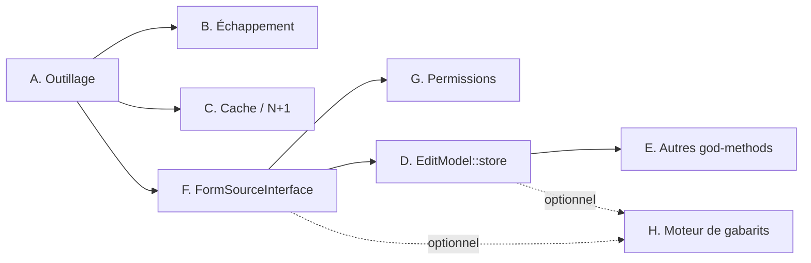

# Plan de refonte architecturale — ContentBuilder NG

> Périmètre : les chantiers identifiés par l'audit du 2026-07-31 et **exclus**
> de la passe de correctifs sécurité (P0/P1 + quick wins), qui, elle, est
> livrée. Ce document ne couvre pas les correctifs déjà appliqués.
>
> Base de référence : 86 000 lignes de source (hors `admin/vendor`,
> `node_modules`), 1 524 méthodes, 689 tests unitaires, PHPStan niveau 2 avec
> baseline de 1 639 lignes, 2 377 erreurs PSR-12.
>
> **État mis à jour au 2026-09-25** : chantier A, étapes 1-2 faites (PSR-12
> en gate global, 0 erreur sur les 218 fichiers couverts par `phpcs.xml.dist`)
> et étape 4 faite (CI : la baseline PHPStan ne peut pas dépasser 1 639 lignes).
> L’étape 3 reste à faire : PHPStan est toujours au niveau 2. Chantier B fait entièrement, deux XSS
> stockées publiques trouvées et corrigées au passage (non citées par
> l'audit du 2026-07-31). Chantier C : N+1 et group_concat faits (étapes
> 3-5) ; la mise en cache de `ListModel::getData()` (étapes 1-2) est
> reportée — décision explicite après lecture complète de la méthode,
> voir le chantier C pour le détail des risques identifiés. Chantier D :
> caractérisation structurelle (pas comportementale) des deux points de
> vigilance ajoutée ; la décomposition elle-même n'a pas commencé. Voir
> chaque chantier ci-dessous pour le détail.

---

## 0. Vue d'ensemble

| # | Chantier | Charge | Risque | Dépend de |
|---|---|---:|---|---|
| A | Outillage qualité (PHPCS, PHPStan 2→6) — **PHPCS fait, PHPStan à faire** | 11 – 16 j restants | Faible | — |
| B | Échappement des sorties front — ✅ fait | — | Faible | A |
| C | Cache et requêtes N+1 — **N+1 faits, cache reporté** | 4 – 7 j restants | Moyen | A |
| D | Décomposition d'`EditModel::store()` — **caractérisation structurelle faite, comportementale et découpage à faire** | 25 – 30 j restants | **Élevé** | A, F |
| E | Décomposition des autres god-methods | 15 – 20 j | Moyen | A, D |
| F | `FormSourceInterface` | 8 – 12 j | Moyen | A |
| G | Refonte du modèle de permission | 10 – 15 j | Moyen | F |
| H | Moteur de gabarits sans `eval()` | 12 – 18 j | **Élevé** | D, F |

**Total : 90 – 126 jours-homme.**

Le chantier H est conservé au plan pour mémoire : la direction a décidé de
**maintenir `eval()`** dans les gabarits. Il n'est pas planifié, mais reste
documenté pour que la décision soit relisible et réversible.

### Ordre d'exécution recommandé



A est le préalable non négociable : sans filet statique et sans style
vérifié, D et E sont des refontes à l'aveugle.

---

## A. Outillage qualité

**Constat.** PHPStan tourne au niveau 2 (sur 10) avec 1 639 lignes de baseline.
PHPCS vient d'être introduit et mesure 2 377 erreurs / 2 425 avertissements sur
218 fichiers, dont 2 262 auto-corrigeables. Le job CI ne contrôle que les
fichiers modifiés d'une PR, ce qui empêche la dette de croître sans la résorber.

### Étapes

1. ✅ **Fait (2026-08-01). Passe `phpcbf` par lots** — 2 262 violations
   auto-corrigeables. Découpé par répertoire, un commit par lot, sans mélange
   avec du changement fonctionnel :

   ```
   admin/src/Controller  →  admin/src/Service  →  admin/src/Helper
   →  admin/src/Model    →  admin/src/View     →  site/src  →  plugins
   →  (reliquat : script.php, admin/layouts, admin/services,
       admin/src/Table, admin/src/Extension, admin/src/Contract,
       admin/src/Dto, site/layouts — hors de la liste initiale ci-dessus,
       repérés en vérifiant que l'arbre était bien propre avant de basculer
       le gate)
   ```

   Après chaque lot : `phpunit` + `phpstan`, verts à chaque fois (693 tests).
   Deux catégories d'erreurs n'étaient pas mécaniquement sûres à corriger et
   ont été traitées au cas par cas plutôt qu'en aveugle :
   - **Visibilité manquante** (`Squiz.Scope.MethodScope.Missing`, ~90
     occurrences) : toujours `public` explicite sur du déjà-implicitement-
     public (Table/View::display, __construct, getData…) — comportement
     inchangé par construction.
   - **Noms en snake_case** (`PSR1.Methods.CamelCapsMethodName`,
     `PSR2.Methods.MethodDeclaration.Underscore`) : renommés seulement quand
     chaque appelant était vérifié `private` + local au même fichier
     (`_buildQuery` → `buildQuery` dans 5 Models ; 4 méthodes de
     `StorageModel`). Exclus du sniff, documenté en commentaire dans
     `phpcs.xml.dist`, dans les cas où le renommage était invisible à grep
     et à PHPStan : tâches de contrôleur routées par nom littéral
     (`UsersController::verified_view` etc.), méthodes de
     `ContentbuilderngHelper` appelées par nom de méthode dynamique
     (`$helperClass::$method(...)`), et la classe d'installation de
     `script.php` résolue par Joomla via `class_exists()` sur un nom fixe.

   Restent exclus de `phpcs.xml.dist` (dette réelle, pas traitée) :
   `admin/src/types/*`, `site/src/Model/EditModel.php`,
   `site/src/Model/ListModel.php`, `site/src/View/Details/HtmlView.php`,
   `admin/src/Model/VerifyModel.php`, et les plugins `download`,
   `image_scale`, `contentbuilderng_themes`. `EditModel.php` en particulier
   est la cible du chantier D ci-dessous, qui exige des tests de
   caractérisation *avant* la première ligne touchée — passer `phpcbf`
   dessus maintenant aurait anticipé sur cette méthode sans le filet qu'elle
   impose.

2. ✅ **Fait (2026-08-01). Basculé le job CI en gate global**, `phpcbf` étant
   passé partout ailleurs. `phpcs -n --report=full` (sans argument, piloté
   entièrement par `phpcs.xml.dist`) tourne maintenant sur PR et sur push,
   bloque sur erreur, tolère les avertissements (longueur de ligne). Le job
   `code-style` est désormais une dépendance du job `package`, ce qu'il
   n'était pas avant faute de pouvoir tourner de façon inconditionnelle.

3. **PHPStan : monter le niveau un cran à la fois — pas commencé.** À chaque
   cran, regénérer
   la baseline puis la résorber, ne jamais l'agrandir :

   | Niveau | Ce qu'il ajoute | Charge estimée |
   |---|---|---:|
   | 3 | types de retour, propriétés | 1 j |
   | 4 | code mort, conditions toujours vraies | 2 j |
   | 5 | types des arguments passés | 3 j |
   | 6 | **types manquants** (le vrai saut) | 5 – 8 j |

   S'arrêter à 6. Les niveaux 7-8 exigent une couverture de typage que le
   code legacy (`types/`, `EditModel`) ne pourra pas offrir avant D et F.

4. **Ajouter un garde anti-régression de baseline — ✅ fait.** Le job PHPStan
   échoue si `phpstan-baseline.neon` dépasse son plafond actuel de 1 639 lignes.
   Abaisser ce plafond dans le même commit que toute réduction de baseline.

**Livrable.** PSR-12 vérifié en gate global ✅ (2026-08-01), garde de baseline
non croissante ✅ (2026-09-25), PHPStan niveau 6 ❌. La charge restante concerne
l'étape 3 ; son estimation devra être révisée hors du présent correctif.

---

## B. Échappement des sorties front — ✅ fait (2026-08-01)

**Constat.** 755 sorties non échappées dans `admin/tmpl`, `admin/layouts`,
`site/tmpl`, `site/layouts`. La majorité est inoffensive (entiers, drapeaux,
classes CSS calculées) ; une quinzaine est alimentée par des données de base.

### Étapes

1. ✅ **Inventorier et classer.** Extraction automatisée de chaque
   occurrence `echo $var` / `<?= $var` (script Python, pas juste un `grep`,
   pour isoler l'expression réellement affichée) puis classement manuel :
   - *sûr* : entiers/booléens de schéma (`row->id`, `->ordering`,
     `->published`…), branches littérales d'un ternaire que le regex
     confond avec la variable comparée (`$x == 'y' ? 'a' : 'b'`), sorties de
     closures qui échappent déjà en interne (`$renderCheckbox`,
     `$renderAuditSummaryLink`…, vérifiées une fois à leur définition, pas
     à chacun de leurs dizaines de sites d'appel), et la pipeline
     `onContentPrepare`/pagination/Form-API de Joomla (`$this->event->…`,
     `$this->pagination->…`, `$editor->display`, `$field->input`) — casser
     ces dernières en les échappant reviendrait à corrompre du HTML déjà
     sûr par convention du framework.
   - *à échapper* : `$this->escape()` ou `htmlspecialchars(…, ENT_QUOTES,
     'UTF-8')` selon la convention déjà dominante dans chaque fichier
     (les deux coexistent dans la base, jamais mélangés dans un même
     fichier).
   - *HTML voulu* : `intro_text`/`introtext` (texte de liste et de
     formulaire, rédigé par un admin via l'éditeur WYSIWYG). Ni
     `HTMLHelper::_('content.prepare', …)` (déclenche le pipeline de
     plugins `onContentPrepare`, effets de bord non maîtrisés pour ce
     contexte) ni un `echo` brut : nouvelle méthode
     `ContentbuilderngHelper::sanitizeStoredHtml()`, un assainisseur HTML à
     liste blanche (`Joomla\CMS\Filter\InputFilter`,
     `ONLY_ALLOW_DEFINED_TAGS` + `ONLY_ALLOW_DEFINED_ATTRIBUTES`) qui
     conserve la mise en forme voulue et retire tout le reste (scripts,
     gestionnaires d'évènements, `iframe`, attribut `style`).

   **Deux vulnérabilités réelles trouvées au-delà de la liste ci-dessous**,
   ni citées par l'audit initial ni couvertes par un test avant ce jour :
   `foreach ($row as $key => $value) { echo nl2br((string) $value); }` dans
   le tableau principal de `site/tmpl/list/default.php`, et `$cardTitle`
   dans sa vue « carte », tous deux construits à partir de valeurs de champ
   soumises par un utilisateur et affichés **côté public**, sans aucun
   échappement (seul `nl2br()` était appliqué). Les deux corrigés.

2. ✅ **Cas déjà identifiés, corrigés — avec une correction à la liste
   elle-même.** `site/tmpl/publicforms/default.php:206,318-319` étaient
   déjà corrigés avant cette passe (fusion `security/audit-remediation`).
   `admin/tmpl/list/select.php`: `$row->colRecord` s'est avéré **toujours
   sûr** une fois tracé jusqu'à sa source SQL (`r.id As colRecord`, une clé
   auto-incrémentée — jamais autre chose que des chiffres) ; seul `$value`,
   son voisin dans la même boucle (valeur de champ libre), avait
   réellement besoin d'être échappé. `$this->page_title`/`intro_text` et
   `$this->lists['order']/['order_Dir']` corrigés comme prévu.
   Non trouvé pendant cette passe et vraisemblablement déjà réglé
   ailleurs : aucune trace d'un `str_replace('::', ';', …)` dans les
   quatre répertoires (voir étape 4).

3. ✅ **Test structurel ajouté** —
   `admin/tests/Unit/Templates/UnescapedTemplateOutputTest.php`. Pas un
   classifieur (un regex ne distingue pas de façon fiable une branche
   littérale de ternaire d'une vraie valeur), mais un garde par comptage,
   même discipline que `phpstan-baseline.neon` : le nombre de
   `echo $var`/`<?= $var` sans marqueur d'échappement sur la ligne est figé
   par fichier à l'état constaté après cette passe (722 occurrences
   restantes, sciemment classées sûres, sur 40 fichiers). Toute
   augmentation fait échouer le test — vérifié en injectant une régression
   volontaire puis en la retirant. Le nombre ne doit baisser qu'à mesure
   qu'un fichier est réellement audité, jamais remonter silencieusement.

4. ✅ **Gestionnaire `onclick` inline de `admin/tmpl/list/select.php`
   nettoyé** — les boutons Rechercher/Réinitialiser portaient du JS
   généré par PHP directement dans l'attribut (`onclick="…<?php echo
   $this->list_state ? "…" : ""; ?>…"`), incompatible avec un
   `script-src` strict. Remplacé par `type="button"` + écouteurs
   `addEventListener` dans le bloc `<script>` du fichier, sur le même
   principe que la délégation déjà en place dans `tmpl/list/default.php`
   (dont le commentaire d'origine indique explicitement qu'elle
   « remplace tous les onclick="contentbuilderng_*()" » — cette
   modernisation n'avait simplement pas atteint la vue « select », un
   layout de modal plus rarement touché). Le style `str_replace('::', ';',
   …)` cité par le constat initial est introuvable dans l'état actuel du
   dépôt ; probablement déjà résolu avant cette passe, sans certitude.

**Livrable.** Sorties classées, cas à risque échappés (dont deux XSS
stockées publiques non citées par l'audit initial), régression bloquée par
un test vérifié à l'échec comme au succès.

694 tests (693 + 1), PHPStan clean, gate PSR-12 intact (0 erreur, les
répertoires `tmpl` ne sont pas dans son périmètre — inchangé depuis le
chantier A).

---

## C. Cache et requêtes N+1 — étapes 3-5 faites (2026-08-01), 1-2 reportées

**Constat.** Deux usages du cache Joomla dans tout le composant. 248 sites de
requête à l'intérieur de boucles.

### Étapes

1. ❌ **Reporté, décision explicite (2026-08-01).** « Cacher le rendu de
   liste frontend » (`ListModel::getData()`, 501 lignes, chemin le plus
   chaud) s'est avéré nettement plus risqué que l'esquisse du plan ne le
   laissait supposer une fois la méthode lue en entier :
   - **Effet de bord en écriture dans un chemin de lecture.** La fonction
     "randomizer" (tri aléatoire périodique) exécute une `UPDATE` sur
     `#__contentbuilderng_records.rand_date` directement dans `getData()`.
     Un cache qui court-circuite l'appel empêcherait cette réinitialisation
     de s'exécuter pendant toute la durée de vie de l'entrée en cache —
     régression fonctionnelle silencieuse, pas juste un problème de fraîcheur.
   - **La clé illustrée par le plan est incomplète.** Le contenu dépend, en
     plus des groupes utilisateur, d'un état de filtre stocké en **session**
     par utilisateur (mots-clés, catégorie d'article, plages calendaires,
     filtres par champ avec une DSL `@range`/`@match`), du tri, de la
     pagination, et d'une restriction « mes enregistrements » **par
     utilisateur** (pas seulement par groupe). Une clé qui omet une de ces
     dimensions est soit une fuite de données entre utilisateurs (le risque
     déjà identifié par le plan), soit un retour de résultats obsolètes/
     incorrects à un utilisateur ayant ses propres filtres actifs — deux
     classes de bug qu'une implémentation précipitée peut introduire sans
     qu'aucun test existant ne le révèle.

   Trois options exposées à l'utilisateur (cache restreint aux vues sans
   filtre actif / cache complet fidèle au plan avec tests dédiés / report) —
   **report choisi**. À reprendre avec un budget dédié, probablement avec
   la même méthode que le chantier D : caractériser le comportement actuel
   avant d'y toucher.

2. ❌ **Reporté avec l'étape 1** (l'invalidation n'a pas de sens sans le cache
   qu'elle invaliderait).

3. ✅ **N+1 résorbés — mais pas ceux cités.** Les lignes citées par l'audit
   du 2026-07-31 avaient dérivé et ne correspondaient plus à un N+1 réel une
   fois vérifiées (`getRecordMetadata()` par exemple n'est jamais appelé en
   boucle sur plusieurs enregistrements — seulement une fois par vue détail/
   édition). Retrouvé par balayage structurel (appel de requête à
   l'intérieur d'un corps de boucle) plutôt qu'en se fiant aux numéros de
   ligne : `synchRecords()` dans **les deux** fichiers `types/` faisait une
   vérification d'existence par ligne avant insertion, alors que la requête
   externe garantissait déjà l'absence de ligne de suivi pour chaque id
   retourné — la vérification ne pouvait jamais être vraie. Remplacé par un
   seul `INSERT IGNORE` multi-lignes (`IGNORE` plutôt qu'un `INSERT`
   multi-lignes ordinaire : InnoDB exécute ce dernier de façon atomique,
   donc une seule ligne perdant une course contre une requête concurrente
   sur la clé unique `(type, reference_id, record_id)` aurait fait échouer
   tout le lot, pas seulement la ligne en conflit).

   `admin/src/View/Storage/HtmlView.php:228,400`, également cité, ne
   contient aucune requête en boucle nulle part dans le fichier actuel —
   probablement déjà résolu avant cette passe, comme le motif CSP du
   chantier B.

4. ✅ **`SET SESSION group_concat_max_len` sorti de la boucle implicite.**
   `FormSourceFactory::getForm()` met en cache une instance par
   `(type, referenceId)`, donc le constructeur de
   `contentbuilderng_com_breezingformsng` s'exécute une fois par formulaire
   distinct traité dans une requête — un écran touchant plusieurs
   formulaires (rapport d'audit, export en masse) relançait ce `SET SESSION`
   à chaque instanciation. Gardé par une variable statique, même motif que
   `RatingHelper::getRating()`.

5. ✅ **PhpSpreadsheet vérifié** — chargé uniquement via des références
   pleinement qualifiées à l'intérieur de
   `StorageModel::convertSpreadsheetFileToCsv()`, appelée seulement depuis
   le chemin d'import CSV/Excel. Rien à corriger.

**Livrable.** N+1 principaux résorbés. Liste frontend cachée : reporté,
décision explicite documentée ci-dessus plutôt qu'une implémentation
risquée sans tests dédiés.

694 tests, PHPStan clean, gate PSR-12 intact.

---

## D. Décomposition d'`EditModel::store()`

**Constat.** 1 327 lignes à ce jour (1 305 au 2026-07-31). Assure à elle seule :
validation CSRF, résolution du formulaire, traitement des téléversements,
validation de champs, appels de plugins, insertion en base, génération
d'articles, notifications e-mail, gestion d'état de liste. **Aucun test ne
la couvre.**

C'est le chantier le plus risqué du plan : c'est le cœur de la soumission
d'enregistrement, et toute régression est silencieuse et coûteuse.

### Méthode — refactoring sous filet, jamais de réécriture

1. 🟡 **Écrire d'abord des tests de caractérisation — partiellement fait
   (2026-08-01).** Avant de toucher une ligne : capturer le comportement
   actuel (y compris les bizarreries) sur les cas nominal, upload,
   validation en échec, quota atteint, article généré, notification. Ces
   tests documentent l'existant, pas l'idéal.

   Ce qui est réellement livré est une **caractérisation structurelle**,
   pas comportementale : `admin/tests/Unit/Model/EditModelStoreInvariantsTest.php`
   fige par assertion sur le texte source (même esprit que
   `EditSparseSubmissionTest.php`, déjà présent dans le projet pour ce
   même fichier) les deux points de vigilance ci-dessous — vérification
   du jeton CSRF en tout premier, ordre écriture-disque → validation →
   suppression sur échec, contrat exact des paramètres de
   `customValidate()`/`customAction()`. Chaque assertion a été vérifiée à
   l'échec en injectant la régression correspondante avant d'être commitée.

   Ce n'est **pas** la caractérisation comportementale que cette étape
   appelle de ses vœux (instancier `EditModel`, appeler `store()`, vérifier
   les effets sur les cas nominal/upload/échec de validation/quota/article/
   notification). Le bouchon `Database` existant
   (`admin/tests/bootstrap.php`) ne sait répondre qu'à une seule requête
   spécifique (`#__usergroups`) ; `store()` en émet une douzaine de
   différentes sur quatre tables, et appelle en plus
   `PluginHelper::importPlugin()`, un mailer et le système de fichiers —
   aucun bouchon pour ces trois-là n'existe. Construire ce harnais est un
   chantier à part entière, pas un raccourci à prendre à la légère : une
   version bâclée donnerait une fausse confiance, pire que l'absence de
   test actuelle. Reste à faire, avec un budget dédié.

2. **Extraire par couches, une par commit**, en gardant la signature publique
   de `store()` intacte à chaque étape :

   ```
   store()
     ├─ UploadFieldProcessor      ~250 lignes   (traitement des fichiers)
     ├─ FieldValidationRunner     ~200 lignes   (validations + plugins)
     ├─ RecordPersister           ~300 lignes   (écriture base)
     ├─ ArticleSynchroniser       ~200 lignes   (délègue à ArticleService)
     ├─ SubmissionNotifier        ~150 lignes   (e-mails)
     └─ ListStateApplier          ~100 lignes   (état de liste, notation)
   ```

3. **Cible :**

   ```php
   final class RecordSubmissionService
   {
       public function __construct(
           private readonly UploadFieldProcessor $uploads,
           private readonly FieldValidationRunner $validation,
           private readonly RecordPersister $persister,
           private readonly ArticleSynchroniser $articles,
           private readonly SubmissionNotifier $notifier,
       ) {}

       public function submit(SubmissionContext $context): SubmissionResult
       {
           $values = $this->uploads->process($context);
           $errors = $this->validation->validateAll($context, $values);

           if ($errors !== []) {
               return SubmissionResult::failed($errors);
           }

           $recordId = $this->persister->persist($context, $values);
           $this->articles->syncForRecord($context, $recordId);
           $this->notifier->notify($context, $recordId, $values);

           return SubmissionResult::ok($recordId);
       }
   }
   ```

4. **`store()` devient une façade** de compatibilité qui construit le
   `SubmissionContext` et délègue. Elle peut rester jusqu'à la version majeure
   suivante.

5. **Chaque collaborateur extrait est immédiatement testé unitairement** — c'est
   le bénéfice principal, pas la réduction du nombre de lignes.

### Points de vigilance

- `customValidate()` / `customAction()` (`EditModel.php:783,790` — les
  lignes 742,749 citées par l'audit du 2026-07-31 ont dérivé) contiennent
  des `eval()` dont le code injecté accède aux variables locales de la
  méthode appelante. Toute extraction change la portée visible : à traiter
  en dernier, ou à figer explicitement le contrat des variables exposées.
  ✅ Contrat figé par test depuis le 2026-08-01
  (`EditModelStoreInvariantsTest::testCustomValidateAndCustomActionKeepTheirExactParameterContract`).
- Le traitement des téléversements écrit sur disque **avant** la validation des
  champs, puis supprime en cas d'échec. Cet ordre doit être préservé ou
  explicitement changé, jamais changé par accident.
  ✅ Ordre figé par test depuis le 2026-08-01
  (`EditModelStoreInvariantsTest::testUploadWritesHappenBeforeValidationWhichCanDeleteThem`).

**Livrable.** 6 services testés, `store()` réduite à une façade, couverture du
chemin de soumission.

---

## E. Décomposition des autres god-methods

**Constat.** 108 méthodes dépassent 100 lignes ; 301 dépassent 50.

### Cibles, par ordre de valeur

| Méthode | Lignes | Note |
|---|---:|---|
| `ContentbuilderngImageScale::onContentPrepare()` | 738 | Plugin ; installe aussi un `set_error_handler()` global à supprimer (cf. §I) |
| `ArticleService::createArticle()` | 662 | Déjà un service ; découper en `ArticleBuilder` + `CategoryResolver` |
| `FormModel::save()` | 661 | Ajouter les transactions au passage (cf. §J) |
| `ListModel::getData()` | 501 | Préalable au cache (§C) |
| `types/*::getListRecords()` | 461 / 373 | Disparaît largement avec §F |
| `TemplateRenderService::getEditableTemplate()` | 436 | Contient `eval()` — prudence |
| `StorageController::save()` | 397 | Contrôleur : la logique doit descendre en service |
| `VerifyModel::__construct()` | 367 | Un constructeur ne doit pas faire ça |

**Règle d'arrêt.** Viser < 60 lignes par méthode, sans en faire un dogme :
mieux vaut 5 méthodes de 80 lignes cohérentes que 20 de 20 lignes artificielles.

---

## F. `FormSourceInterface`

**Constat.** `admin/src/types/*.php` (3 149 lignes) utilise un namespace en
minuscules hors convention, est chargé par `require_once` dynamique construit
depuis une valeur en base, et instancié par `call_user_func`.

### Cible

```php
namespace CB\Component\Contentbuilderng\Administrator\FormSource;

interface FormSourceInterface
{
    public function getRecords(RecordQuery $query): RecordCollection;
    public function getRecord(int $recordId): ?Record;
    public function isOwner(int $userId, int $recordId): bool;

    /**
     * @param list<int> $recordIds
     * @param int|null  $restrictToUserId Obligatoire quand le droit est limité
     *                                    aux enregistrements de l'utilisateur.
     */
    public function delete(array $recordIds, int $formId, ?int $restrictToUserId = null): bool;
}
```

> Le paramètre `$restrictToUserId` est dans le **contrat**, pas optionnel par
> confort : c'est ce qui rend structurellement impossible la classe de faille
> corrigée en S-01.

### Étapes

1. Définir l'interface et les DTO (`RecordQuery`, `Record`, `RecordCollection`).
2. Adapter `contentbuilderng_com_contentbuilderng` puis
   `contentbuilderng_com_breezingformsng` derrière l'interface, sans changer
   leur comportement.
3. Remplacer `FormSourceFactory` par une fabrique enregistrée dans le
   conteneur, avec une **carte explicite** type → classe. Supprime le
   `require_once` construit depuis la base (gadget LFI).
4. Conserver un adaptateur pour les sources tierces déposées dans
   `media/contentbuilderng/types/`, avec validation stricte du nom
   (`/^[a-z0-9_]+$/i`) et chargement par autoloader.
5. Remplacer le contrat `getNumRecordsQuery()` (qui renvoie du **SQL brut**
   injecté dans un `SELECT`) par une méthode retournant un entier.

**Livrable.** Sources de formulaires autoloadées, typées, testables ; plus
aucune inclusion dynamique pilotée par la base.

---

## G. Refonte du modèle de permission

**Constat.** La passe de sécurité a colmaté la faille (clé de session portée par
formulaire + marqueur de contexte vérifié + filtre propriétaire en SQL). Le
**design** reste fragile : l'autorisation dépend d'un état de session, et la
correction repose sur une discipline d'appel — armer avant de vérifier.

### Cible — service sans état

```php
final readonly class PermissionContext
{
    /** @param list<int> $recordIds */
    public function __construct(
        public int $formId,
        public array $recordIds,
        public int $userId,
        public bool $frontend,
    ) {}
}

final readonly class PermissionDecision
{
    public function __construct(
        public bool $allowed,
        public string $reason,
        public bool $ownerScoped,
    ) {}
}

interface PermissionEvaluatorInterface
{
    public function evaluate(string $action, PermissionContext $context): PermissionDecision;
}
```

### Étapes

1. Implémenter l'évaluateur sans session ; cache **mémoire par requête**,
   indexé par le contexte complet.
2. Migrer les appelants un par un, en gardant `PermissionService` comme façade.
3. Supprimer la façade et le stockage en session.
4. `PermissionDecision::$ownerScoped` remplace `hasGroupGrant()` et alimente
   directement le `$restrictToUserId` de `FormSourceInterface::delete()`.

**Bénéfice.** L'autorisation ne peut plus être « héritée » d'une requête
précédente : le contexte est un argument, pas un état.

---

## H. Moteur de gabarits sans `eval()` — *non planifié*

> **Décision de la direction : `eval()` est conservé.** Ce chantier est
> documenté pour mémoire et n'est pas ordonnancé.

**Risque accepté.** Les champs `details_prepare` et `editable_prepare`
(`admin/forms/form.xml:127,147`, `filter="raw"`) sont exécutés par `eval()` au
rendu frontend. Toute personne disposant de `core.edit` sur le composant peut
donc exécuter du PHP arbitraire sur le serveur — une escalade de privilège que
Joomla protège habituellement par `core.admin`.

**Atténuation possible sans perdre la fonctionnalité**, si la position évolue :
restreindre l'**écriture** de ces deux champs à `core.admin`. Les gabarits
existants continuent de s'exécuter à l'identique ; seule la modification est
réservée aux Super Utilisateurs. Coût : ~0,5 j.

**Refonte complète, si un jour souhaitée.** L'infrastructure existe déjà
(`replaceTemplateFieldToken()` fait du remplacement `{champ:value}`) : l'étendre
à des directives déclaratives (conditions, boucles, formatage) supprimerait la
surface RCE et rendrait les gabarits analysables statiquement. 12 – 18 j.

---

## I. Chantiers courts hors refonte

À traiter au fil de l'eau, indépendamment du reste :

| Sujet | Localisation | Charge |
|---|---|---:|
| `set_error_handler()` vide global — supprime toutes les notices du site | `ContentbuilderngImageScale.php:30-31` | 0,5 j |
| Sortir la génération du classeur du gabarit (violation MVC) | `site/tmpl/export/default.php` (293 l.) | 2 j |
| Événements `GenericEvent` par chaîne → classes typées | 19 occurrences | 2 j |
| Tâches Scheduler (purge notations, vérifications, journaux) | — | 3 j |
| Service Locator `PermissionService::createFromRuntimeContext()` → conteneur | `ApiController` et 4 autres | 1 j |
| Requête d'état sans filtre `form_id` (peut lire l'état d'un autre formulaire) | `site/tmpl/export/default.php:149-154` | 0,5 j |

---

## J. Transactions

**Constat.** Deux usages dans tout le composant. Ne sont pas transactionnels
alors qu'ils le devraient :

| Opération | Localisation |
|---|---|
| Sauvegarde d'un stockage (`RENAME` + `ALTER` + métadonnées) | `StorageModel.php:634-903` |
| Sauvegarde d'un formulaire (formulaire + éléments + options + assets) | `FormModel.php:944` |
| Copie de formulaire | `FormController.php:899-1034` |
| Synchronisation de colonnes | `DatatableService.php:447-620` |

À traiter **pendant** les chantiers D et E, pas après : ces méthodes seront
déjà ouvertes.

> Le DDL n'étant pas transactionnel sous MySQL/MariaDB, prévoir en plus un
> chemin de compensation explicite pour les `ALTER`/`RENAME`.

---

## Jalons

| Jalon | Contenu | Charge cumulée |
|---|---|---:|
| **M1 — Filet** | A complet, PHPStan 6, PSR-12 en gate global | 15 j |
| **M2 — Surface** | B + I | 25 j |
| **M3 — Fondations** | F + G | 52 j |
| **M4 — Cœur** | D + J | 85 j |
| **M5 — Finition** | E + C | 115 j |

Un jalon ne démarre qu'avec les tests du précédent au vert. M4 est le seul
jalon où une régression fonctionnelle est probable : prévoir une recette
manuelle sur le parcours de soumission complet.

---

## Indicateurs de suivi

À mesurer à chaque jalon :

```bash
# Méthodes > 100 lignes            (départ : 108)
# Erreurs PSR-12                   (départ : 2 377)
admin/vendor/bin/phpcs --report=summary | tail -3

# Lignes de baseline PHPStan       (départ : 1 639)
wc -l phpstan-baseline.neon

# Tests et couverture              (départ : 689 tests)
cd admin && vendor/bin/phpunit --coverage-text
```

**Critère de sortie global :** aucune méthode > 150 lignes, PHPStan niveau 6
sans baseline, PSR-12 sans exclusion, couverture du chemin de soumission
d'enregistrement.
