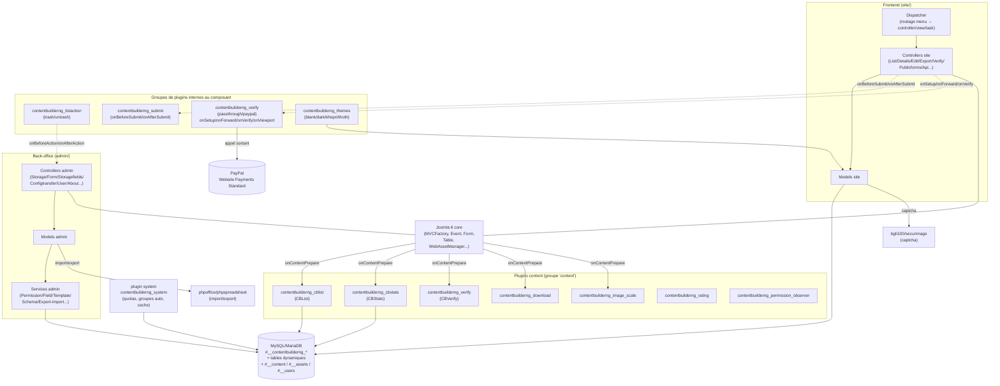

# 01 — Vue d'ensemble

> Document de synthèse de la rétro-analyse de `com_contentbuilderng`
> ("ContentBuilder NG"). Reconstruit depuis le code source (source de vérité
> principale) ; la documentation existante (`docs/en`, `docs/fr`,
> `docs/specifications`) a été utilisée comme matériau complémentaire et
> vérifiée contre le code, jamais présumée exacte par défaut.
>
> Légende utilisée dans tout `docs/reverse-engineering/` : **Fait observé**
> (constaté directement dans le code, référence fichier:ligne à l'appui),
> **Comportement déduit** (inféré à partir de plusieurs faits observés sans
> lecture ligne à ligne exhaustive), **Hypothèse** (probable mais non
> vérifié), **Zone inconnue** (non déterminable avec certitude depuis ce
> dépôt).

## 1. Rôle global de l'extension

**Fait observé** : `com_contentbuilderng` est une extension Joomla 6
(composant + 17 plugins) qui permet de définir, depuis le back-office, des
structures de données personnalisées ("Storages", éventuellement adossées à
une table SQL physique dédiée), de construire des formulaires/vues
("Forms") au-dessus de ces structures avec des champs ("Elements"), puis de
publier ces vues côté frontend pour la saisie, la consultation, la
recherche, le filtrage, l'export et l'affichage listé/statistique du
contenu ainsi collecté (`{CBList}`, `{CBStats}`). Chaque enregistrement
soumis peut être adossé à un article Joomla natif (`#__content`), ce qui
permet au contenu généré de bénéficier du pipeline de rendu/SEO/ACL standard
de Joomla.

**Comportement déduit** : il s'agit fonctionnellement d'un constructeur de
formulaires/bases de données "no-code" pour Joomla (dans la même famille que
BreezingForms, dont il porte l'héritage — voir `authorUrl` dans les
manifestes : `breezingforms-ng.vcmb.fr`, et l'ancien type de champ legacy
`com_breezingformsng` documenté dans `03-data-model.md`/`07-security.md`),
avec un module de vérification/paiement (captcha, activation par email,
PayPal), un moteur de permissions applicatif propre (au-dessus de l'ACL
Joomla), et un ensemble de plugins de rendu de contenu (`{CBList}`,
`{CBStats}`) réutilisables dans n'importe quel article Joomla.

**Hypothèse** : le nom "NG" (Next Generation) et le commentaire de licence
« XDA+GIL » suggèrent une réécriture/maintenance en cours par une équipe
distincte de l'auteur historique de BreezingForms — cohérent avec les
conventions de branche `gil_<version>` documentées dans `AGENTS.md` du
dépôt.

## 2. Extensions Joomla livrées

| # | Type | Groupe | Nom technique | Rôle en une phrase |
|---|------|--------|----------------|---------------------|
| 1 | component | — | `com_contentbuilderng` | Cœur : admin (gestion des storages/forms/elements/utilisateurs) + site (soumission/consultation/API) |
| 2 | plugin | content | `contentbuilderng_cblist` | Rend le tag `{CBList}` dans tout contenu Joomla (liste d'enregistrements) |
| 3 | plugin | content | `contentbuilderng_cbstats` | Rend le tag `{CBStats}` (graphiques Chart.js sur les enregistrements) |
| 4 | plugin | content | `contentbuilderng_download` | Gère le téléchargement de fichiers liés à un enregistrement |
| 5 | plugin | content | `contentbuilderng_image_scale` | Redimensionnement d'images uploadées (paramètre `max_filesize`) |
| 6 | plugin | content | `contentbuilderng_permission_observer` | Point d'observation/ajustement des permissions au rendu de contenu |
| 7 | plugin | content | `contentbuilderng_rating` | Notation des enregistrements (`rating_cache`, `records.rating_*`) |
| 8 | plugin | content | `contentbuilderng_verify` | Rend le tag `{CBVerify}` (statut de vérification dans le contenu) |
| 9 | plugin | contentbuilderng_listaction | `trash` | Action de liste : mise à la corbeille (synchronise `#__content.state`) |
| 10 | plugin | contentbuilderng_listaction | `untrash` | Action de liste : restauration |
| 11 | plugin | contentbuilderng_submit | `submit_sample` | Exemple de référence du contrat `onBeforeSubmit`/`onAfterSubmit` |
| 12 | plugin | contentbuilderng_themes | `blank` | Thème de rendu frontend (CSS minimal) |
| 13 | plugin | contentbuilderng_themes | `dark` | Thème de rendu frontend (mode sombre) |
| 14 | plugin | contentbuilderng_themes | `khepri` | Thème de rendu frontend |
| 15 | plugin | contentbuilderng_themes | `thoth` | Thème de rendu frontend, thème de repli par défaut, seul à utiliser le WebAssetManager Joomla |
| 16 | plugin | contentbuilderng_verify | `passthrough` | Vérification "toujours acceptée" (pas de contrôle réel) |
| 17 | plugin | contentbuilderng_verify | `paypal` | Vérification par paiement PayPal (Website Payments Standard, legacy) |
| 18 | plugin | system | `contentbuilderng_system` | Tâches transverses (quotas de soumission, groupes auto-gérés, cache) — détail dans `08-configuration.md` |

**Fait observé** : aucun module (`mod_*`) n'est livré par ce dépôt.

Détail complet de chaque plugin (déclencheur, effets de bord, contrat
d'événement) : voir `04-features.md`. Détail des événements Joomla
internes propres au composant (signatures) : voir `06-api-contracts.md`
§5.

## 3. Interfaces utilisateur et points d'entrée

- **Back-office** (`admin/`) : menu Joomla à 3 entrées (`COM_CONTENTBUILDERNG`
  → sous-menus `forms` (COM_CONTENTBUILDERNG_LIST, vue par défaut),
  `storages`, `about`) — **Fait observé** (`com_contentbuilderng.xml`
  §`<administration><submenu>`). Écrans additionnels non présents dans le
  menu mais accessibles par navigation interne : édition Storage, Storage
  Wizard, Form (14 onglets), Elements/Options, Titlesets, Config Transfer,
  gestion Utilisateurs par vue, écran About/Audit/Repair.
- **Frontend** (`site/`) : point d'entrée unique `index.php?option=com_contentbuilderng`
  routé par `site/src/Dispatcher/Dispatcher.php`, qui traduit les paramètres
  de l'item de menu Joomla (form_id, category_id, limites de liste, thème,
  champs affichés...) en `controller`/`view`/`task` avant de déléguer au
  dispatcher standard Joomla (**Fait observé**, lu intégralement). Vues :
  liste, détail, édition/soumission, export, vérification/paiement,
  formulaires publics (annuaire), aides contextuelles.
- **API interne** : `site/src/Controller/ApiController.php`
  (`task=api.display` + sous-actions), voir `06-api-contracts.md`.
- **Rendu embarqué dans du contenu Joomla tiers** : tags `{CBList}`,
  `{CBStats}`, `{CBVerify}` interprétés par les plugins de contenu à
  l'événement `onContentPrepare`.
- **Installation/mise à jour** : `script.php` (méthodes `install`/`update`/
  `uninstall`/`preflight`...), déclenché par l'installeur Joomla.

## 4. Données persistées

**Fait observé** — 13 tables propres au composant, préfixe
`#__contentbuilderng_*` : `storages`, `storage_fields`, `forms`, `elements`,
`records`, `list_states`, `list_records`, `articles`, `users`,
`registered_users`, `verifications`, `rating_cache`, `resource_access`.
Détail complet (colonnes, types, cycle de vie, traçabilité lecture/écriture/
suppression) : `03-data-model.md`.

**Fait observé** : chaque Storage peut en outre matérialiser une table SQL
physique dynamique (`#__<storage.name>`, hors préfixe `contentbuilderng_`)
selon l'option `bytable`. Le composant écrit aussi directement dans des
tables Joomla natives : `#__content` (articles générés par les soumissions),
`#__assets` (arbre d'ACL Joomla pour ces articles), `#__users`/`#__user_usergroup_map`
(comptes créés lors d'une inscription front, groupes "auto-gérés").
**Fait observé** : aucune abstraction UCM Joomla (`#__ucm_content`) n'est
utilisée — le composant manipule ces tables Joomla en SQL direct.

Titlesets sont **Fait observé** stockés en fichiers `.ini` sur disque, pas
en base.

## 5. Diagramme d'architecture (vue d'ensemble)

Ce diagramme est une simplification : le détail exact des événements et de
leurs signataires est dans `06-api-contracts.md` §5, l'architecture
technique fichier-par-fichier dans `02-architecture.md`.

## 6. Ce que ce document ne couvre pas

Voir les 13 autres documents de `docs/reverse-engineering/` pour le détail :
modèle de données (03), architecture technique (02), catalogue de
fonctionnalités (04), parcours utilisateurs (05), contrats API/AJAX (06),
sécurité (07), configuration (08), règles métier (09), dépendances (10),
flux d'exécution en diagrammes (11), dette technique (12), zones
d'incertitude consolidées (13), traçabilité fonctionnalité → code (14).

## 7. Limites de cette rétro-analyse

- Aucune exécution du code (pas d'environnement PHP/MySQL disponible pour ce
  travail) : toutes les affirmations reposent sur la lecture statique du
  code, jamais sur une observation en exécution. Signalé explicitement
  partout où cela limite la certitude d'une affirmation.
- L'historique Git a été consulté pour documenter l'évolution (notamment
  dans `12-technical-debt.md`) mais n'a jamais été traité comme décrivant
  le comportement actuel.
- Le code des bibliothèques externes (securimage, phpspreadsheet) n'a pas
  été analysé en profondeur — seul leur usage par le code du composant est
  documenté (`10-dependencies.md`).
