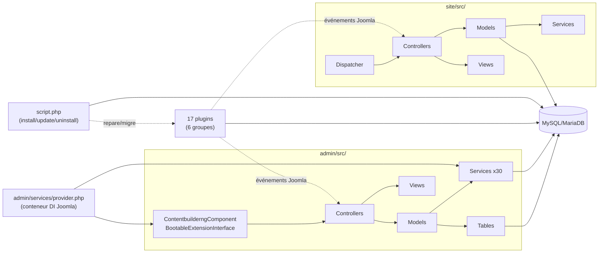

# 02 — Architecture technique

> Légende : **Fait observé** / **Comportement déduit** / **Hypothèse** /
> **Zone inconnue** — voir `01-overview.md`.

## 1. Namespace et bootstrap

**Fait observé** (`com_contentbuilderng.xml:17`, `admin/services/provider.php`,
`site/src/Dispatcher/Dispatcher.php`) : namespace racine PSR-4
`CB\Component\Contentbuilderng`, sous-espaces `\Administrator\*` (admin) et
`\Site\*` (site), point d'entrée admin `admin/src/Extension/ContentbuilderngComponent.php`
(implémente `MVCComponent`, `BootableExtensionInterface`,
`RouterServiceInterface`), enregistrement des services via
`admin/services/provider.php` (un seul provider pour le composant entier —
`MVCFactory`, `ComponentDispatcherFactory`, `RouterFactory` Joomla standard,
plus ~19 services applicatifs propres enregistrés directement dans le
conteneur DI, voir §3).

Chaque plugin a son propre `services/provider.php` (**Comportement déduit**,
cohérent avec Joomla 6 ; confirmé pour `contentbuilderng_system` dans son
manifeste `<files><filename plugin="contentbuilderng_system">services/provider.php</filename>`).

## 2. Découpage MVC

### Admin (`admin/src/`)

| Couche | Fichiers | Détail |
|---|---|---|
| Controller | 15 (`admin/src/Controller/`) | `AboutController`, `ConfigtransferController`, `DatatableController`, `DisplayController`, `ElementoptionsController`, `FormController`, `FormsController`, `StorageController`, `StoragefieldController`, `StoragesController`, `StoragewizardController`, `TitlesetController`, `UsersController` + `Traits/` (dont `ComponentAccessTrait`, gate ACL `core.manage` global — `07-security.md`) |
| Model | 14 | Un par entité/écran (Storage, Storages, Form, Forms, Storagefields, Elementoptions, Configtransfer, Titleset, Users, About...) |
| View | 16 (`admin/src/View/`) | `About`, `Configtransfer`, `Contentbuilderng` (vue par défaut, page d'accueil), `Edit`, `Elementoptions`, `Form`, `Forms`, `Storage`, `Storages`, `Storagewizard`, `Titleset`, `Titlesets`, `User`, `Users`, `Verify` |
| Table | 6 (`admin/src/Table/`) | `CbuserTable`, `ElementoptionsTable`, `FormTable`, `ListTable`, `StorageFieldsTable`, `StorageTable` |
| Service | 30 (`admin/src/Service/`) | Couche métier propre (voir §3) — pas de couche "Model Joomla classique" seule, une partie importante de la logique vit dans ces services injectés |
| Helper | 39 | Utilitaires transverses (logs, audit, schéma, permissions, sécurité fichiers...) |
| Field | 2 | Champs de formulaire JForm spécifiques admin |
| Rule | 1 | Règle de validation JForm personnalisée |

**Fait observé** : `admin/src/View/Edit/` existe côté admin (prévisualisation
d'un enregistrement depuis l'écran Storage) mais son Model attendu
`Administrator\Model\EditModel` est **introuvable dans le dépôt** (seul
`site/src/Model/EditModel.php` existe) — signalé comme anomalie potentielle
dans `12-technical-debt.md`/`13-unknowns.md`.

### Site (`site/src/`)

| Couche | Fichiers | Détail |
|---|---|---|
| Controller | 10 | `ApiController`, `CblisthelpController`, `CbstatshelpController`, `DetailsController`, `DisplayController`, `EditController`, `ExportController`, `ListController`, `PublicformsController`, `VerifyController` |
| Model | 10 | Un par contrôleur, dont `EditModel` (la plus volumineuse — voir §4) |
| View | 10 | `Cblisthelp`, `Cbstatshelp`, `Contentbuilderng`, `Details`, `Edit`, `Export`, `Latest`, `List`, `Publicforms`, `Verify` |
| Table | 1 | Table applicative site (liée aux enregistrements) |
| Field | 11 | **Fait observé (correction)** : malgré le nom `Site\Field`, ces classes sont des champs JForm pour l'écran **admin** d'édition d'un item de **menu** Joomla (sélecteur de vue/catégorie/storage pour paramétrer un menu pointant vers ce composant), pas des types de champ pour le formulaire d'un enregistrement (ceux-ci sont gérés autrement, voir `04-features.md`) |
| Service | 18 | Couche métier site (permissions de prévisualisation, rendu de template, filtrage menu...) |
| Helper | 12 | |
| Dispatcher | 1 | `Dispatcher.php` (routage menu → controller/view/task, voir §5) |
| Element | 0 | Dossier présent mais vide |

**Fait observé (anomalie de dépôt)** : deux fichiers nommés `Dispatcher.php`
existent sous `site/src/` : le vrai (`site/src/Dispatcher/Dispatcher.php`,
utilisé par `ContentbuilderngComponent`) et un second sous
`site/src/Controller/Dispatcher.php` qui apparaît comme du code mort (aucune
référence trouvée ailleurs) — signalé dans `13-unknowns.md` pour
vérification humaine (Gilles).

## 3. Couche Service (admin, extrait des 30 enregistrées dans `provider.php`)

**Fait observé** — services applicatifs injectés via le conteneur DI Joomla
(liste non exhaustive, voir `admin/services/provider.php` pour la liste
complète) : `DatatableService` (création/synchro de table physique de
storage), `StorageFieldService`, `ExternalTableService`, `PathService`,
`FormSupportService`, `TemplateSampleService`,
`DirectStorageFormProvisioningService`, `PermissionService` (moteur de
permissions applicatif — cœur de `07-security.md`/`09-business-rules.md`),
`ArticleService` (génération/synchronisation des articles Joomla),
`ListSupportService`, `MenuService` (création d'items de menu, y compris
des méthodes historiques `createBackendMenuItem15/16/3` signalées comme
code mort dans `12-technical-debt.md`), `FormResolverService`,
`RuntimeUtilityService`, `TemplateRenderService` (moteur de gabarit avec
`eval()` sur texte configurable en base — voir `07-security.md`/
`12-technical-debt.md`), `TextUtilityService`, `ApiFieldPermissionService`,
`FieldValidationService`.

Cette architecture en services (plutôt que la logique concentrée dans les
Models Joomla classiques) est le principal écart aux patrons MVC "natifs"
Joomla — cohérent avec `AGENTS.md` qui demande de "préférer les patrons
admin Joomla 6 natifs" mais documente ici un existant qui s'en écarte par
endroits (ex. `EditModel::store()` de 1500+ lignes côté site, cf.
`12-technical-debt.md`).

## 4. Fichiers volumineux structurants

**Fait observé** (déjà quantifié dans `12-technical-debt.md`) :
- `script.php` (racine, ~2469 lignes / 96 méthodes) : installation, mise à
  jour, désinstallation, auto-réparation de schéma (`ensure*`), réparation
  de menus, gestion des plugins, migration legacy ContentBuilder→NG.
- `site/src/Model/EditModel.php::store()` (767-2294) : traitement complet
  d'une soumission d'enregistrement front (validation, upload, captcha,
  génération d'article, vérification, notation...).
- `admin/src/types/*.php` (~3149 lignes cumulées) : système de "types de
  champ" du composant (voir §6), namespace hors convention PSR.

## 5. Routage frontend

**Fait observé** (`site/src/Dispatcher/Dispatcher.php`, lu intégralement) :
le composant n'utilise pas le routage Joomla SEF standard comme seul
mécanisme — son `Dispatcher::dispatch()` intercepte la requête avant le
dispatch Joomla standard et :
1. Résout l'item de menu actif (`Itemid` ou item actif) et lit ses
   paramètres propres au composant (`form_id`, `record_id`, `cb_category_id`,
   `cb_list_limit`, `cb_theme_plugin`, affichage des barres/boutons,
   filtrage par catégorie, champs de recherche/lien/détail/édition/export...).
2. Réinjecte ces paramètres de menu dans l'objet `Input` Joomla (avec
   quelques clés explicitement "surchageables" par la requête, ex.
   `cb_show_author`), pour que le reste du composant les lise comme un
   paramétrage normal.
3. Détermine dynamiquement `controller`/`view`/`task` à partir de la
   combinaison `view`/`task`/`cb_controller`/présence d'`id`/`storage_id`
   (ex. `view=list` sans `id` ni `storage_id` → bascule vers le contrôleur
   `publicforms` ; `view=details` → contrôleur `details` ; `cb_controller=edit`
   → contrôleur `edit`).
4. Persiste en session le dernier `layout` demandé par item de menu
   (`com_contentbuilderng.layout.<itemId><layout>`).
5. Délègue enfin à `ComponentDispatcher::dispatch()` (Joomla core) avec ces
   valeurs résolues.

**Comportement déduit** : ce mécanisme permet à un même Form/Storage
d'être exposé sous plusieurs items de menu avec des comportements
différents (limite de liste, champs visibles, thème, catégorie de filtrage)
sans dupliquer de code contrôleur — la configuration vit dans les
paramètres de l'item de menu Joomla (`admin/forms/*.xml` probable pour leur
déclaration — non vérifié en détail ici, voir `08-configuration.md`).

## 6. Système de "types" de champ (`admin/src/types/`)

**Fait observé** (déjà relevé par l'agent dette technique, `12-technical-debt.md`) :
`admin/src/types/*.php` implémente les types de champ du composant
(texte, liste, fichier, éditeur, `com_breezingformsng` legacy...) via un
chargement dynamique (`require_once` construit depuis une valeur stockée en
base) plutôt que via le système `Field` JForm standard de Joomla pour cette
partie précise. Signalé comme point de dette technique et de surface
d'attaque potentielle (qualifié de "gadget LFI" par les développeurs
eux-mêmes selon `REFACTORING_PLAN.md`) — voir `07-security.md` et
`12-technical-debt.md` pour le détail, non reproduit ici.

## 7. Assets frontend (`media/`)

**Fait observé** : pas de bundler JS (`package.json` racine ne sert que
`stylelint`) — 10 fichiers JS et 22 fichiers CSS écrits à la main dans
`media/js/`/`media/css/`. Deux bibliothèques JS tierces identifiées
(`10-dependencies.md`) : Coloris (CDN jsdelivr, sélecteur de couleur admin)
et Chart.js 4.5.1 (vendored localement, utilisé uniquement par
`contentbuilderng_cbstats`). Le thème `thoth` est le seul à s'intégrer au
`WebAssetManager` Joomla natif ; les autres thèmes (`blank`/`dark`/`khepri`)
injectent du CSS brut en ligne via le plugin système.

## 8. Diagramme — composants et flux de dépendance

Diagrammes de séquence par fonctionnalité (soumission, installation,
vérification PayPal, rendu `{CBList}`...) : `11-execution-flows.md`.
