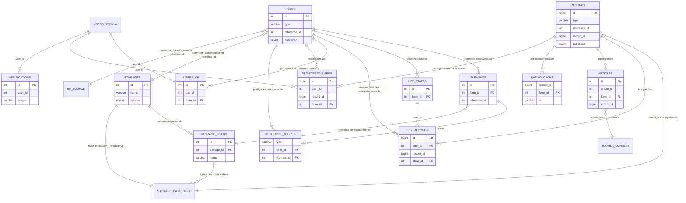

# 03 — Modèle de données

> Rétro-analyse (reverse engineering) de `com_contentbuilderng` — Joomla 6 / PHP 8.3+
> / MySQL-MariaDB. Ce document couvre exclusivement le **modèle de données** du
> composant : les 13 tables `#__contentbuilderng_*`, les tables de données
> créées dynamiquement pour les "storages" internes, et les dépendances vers
> les tables natives Joomla (`#__content`, `#__assets`, `#__users`).
>
> Méthode de qualification des affirmations :
> - **Fait observé** : lu directement dans le code, avec référence `fichier:ligne`.
> - **Comportement déduit** : logique assemblée à partir de plusieurs faits observés.
> - **Hypothèse** : interprétation plausible non totalement vérifiée dans le code lu.
> - **Zone inconnue / à vérifier** : point non tranché, incohérence potentielle,
>   ou dette technique à signaler.
>
> Le schéma "état final" documenté ici est **`admin/sql/install.sql`** (utilisé
> tel quel pour toute nouvelle installation). Les 19 fichiers de
> `admin/sql/updates/mysql/` ont été lus intégralement (§1) : chacun d'eux est
> soit un simple marqueur de version dans `#__schemas` (aucun changement de
> schéma), soit un `ALTER TABLE` dont le résultat final est déjà présent dans
> `install.sql`. **Aucune contradiction n'a été trouvée entre les migrations et
> `install.sql`** — voir le détail du rapprochement en §1.2. Une partie du
> schéma est en outre maintenue à jour par des routines d'auto-réparation
> ("self-heal") exécutées à chaque installation/mise à jour par
> `admin/src/Service/SchemaService.php` depuis `script.php::postflight()` ; ces
> routines sont citées où elles s'appliquent.

## Sommaire

0. [Méthodologie et périmètre](#0-méthodologie-et-périmètre)
1. [Vue d'ensemble du schéma versionné](#1-vue-densemble-du-schéma-versionné)
2. [`#__contentbuilderng_storages`](#2-__contentbuilderng_storages)
3. [`#__contentbuilderng_storage_fields`](#3-__contentbuilderng_storage_fields)
4. [`#__contentbuilderng_forms`](#4-__contentbuilderng_forms)
5. [`#__contentbuilderng_elements`](#5-__contentbuilderng_elements)
6. [`#__contentbuilderng_records`](#6-__contentbuilderng_records)
7. [`#__contentbuilderng_list_states`](#7-__contentbuilderng_list_states)
8. [`#__contentbuilderng_list_records`](#8-__contentbuilderng_list_records)
9. [`#__contentbuilderng_articles`](#9-__contentbuilderng_articles)
10. [`#__contentbuilderng_users`](#10-__contentbuilderng_users)
11. [`#__contentbuilderng_registered_users`](#11-__contentbuilderng_registered_users)
12. [`#__contentbuilderng_verifications`](#12-__contentbuilderng_verifications)
13. [`#__contentbuilderng_rating_cache`](#13-__contentbuilderng_rating_cache)
14. [`#__contentbuilderng_resource_access`](#14-__contentbuilderng_resource_access)
15. [Tables de données dynamiques des storages internes (`#__<storage.name>`)](#15-tables-de-données-dynamiques-des-storages-internes-__storagename)
16. [Dépendances Joomla natives (`#__content`, `#__assets`, `#__users`) et absence d'UCM](#16-dépendances-joomla-natives-__content-__assets-__users-et-absence-ducm)
17. [Cycle de vie transversal (installation / désinstallation)](#17-cycle-de-vie-transversal-installation--désinstallation)
18. [Relations entre entités](#18-relations-entre-entités)
19. [Zones d'incertitude](#19-zones-dincertitude)

---

## 0. Méthodologie et périmètre

**Fait observé** : le schéma est réparti sur trois artefacts SQL/PHP :
- `admin/sql/install.sql` (735 lignes) : `CREATE TABLE IF NOT EXISTS` pour les
  13 tables, déjà abondamment commenté colonne par colonne dans le fichier
  lui-même (`admin/sql/install.sql:1-735`).
- `admin/sql/uninstall.sql` (13 lignes) : 13 `DROP TABLE IF EXISTS`, un par
  table — parité exacte avec les 13 `CREATE TABLE` d'`install.sql` (aucune
  table orpheline).
- `admin/sql/updates/mysql/*.sql` (19 fichiers, voir §1) : migrations
  incrémentales appliquées par le moteur Joomla lors d'une mise à jour, sur la
  base de `#__schemas`.

En complément, `admin/src/Service/SchemaService.php` exécute à chaque
installation/mise à jour (`script.php:376-387`, dans `postflight()`) des
routines idempotentes de vérification/réparation de colonnes, index et
valeurs — un mécanisme de "self-heal" qui **double** certaines migrations
versionnées (ex. `field_size`, voir §1.2) pour couvrir les mises à jour
directes depuis d'anciennes versions non linéaires.

Les classes `Joomla\CMS\Table\Table` du composant sont peu nombreuses au
regard des 13 tables : seules **6** tables ont une classe `Table` dédiée
(`admin/src/Table/FormTable.php`, `ListTable.php`, `CbuserTable.php`,
`StorageTable.php`, `StorageFieldsTable.php`, `ElementoptionsTable.php`, plus
`site/src/Table/ListTable.php` qui étend `FormTable`/`ListTable` admin). Les 7
autres tables (`articles`, `list_records`, `list_states`, `rating_cache`,
`records`, `registered_users`, `resource_access`, `verifications` — soit 8 en
réalité, `list_states` étant gérée par SQL brut malgré son lien fort à
`forms`) sont manipulées exclusivement par des requêtes SQL construites à la
main via `$db->getQuery(true)` dans les Models/Services/Controllers/plugins.
Ceci est cohérent avec l'énoncé de la mission (6 fichiers `Table` en
`admin/src/Table/`, 1 en `site/src/Table/`).

---

## 1. Vue d'ensemble du schéma versionné

### 1.1 Chronologie des 19 fichiers de migration

**Fait observé** — contenu intégral lu, classé par ordre chronologique de
version (le nom de fichier suit le numéro de version du composant, pas un
timestamp) :

| Fichier | Effet |
|---|---|
| `6.1.7.sql` | Marqueur de version uniquement — aucun changement de schéma (commentaire explicite : les installations existantes sont déjà à niveau via `install.sql`/`script.php`). |
| `6.1.7.104.sql` | `ALTER TABLE #__contentbuilderng_storage_fields ADD COLUMN required TINYINT(1) NOT NULL DEFAULT 0`, puis `UPDATE ... SET required = 1` pour les colonnes système des storages internes (`id`, `user_id`, `created`, `created_by`, `modified_user_id`, `modified_by`) sur les storages `bytable = 0`. Commentaire du fichier lui-même : `field_size` (colonne voisine) n'a **jamais** eu de migration versionnée dédiée — seulement `install.sql` (neuf) et le self-heal `SchemaService::ensureStorageFieldSizeColumn()` (mise à jour), volontairement, pour éviter un `ALTER … AFTER field_size` qui casserait une mise à jour depuis une version antérieure à `field_size`. |
| `6.1.7-RC101.sql` | Ajoute `details_template_locked` et `editable_template_locked` (`TINYINT(1) DEFAULT 0`) sur `#__contentbuilderng_forms`. |
| `6.1.8.sql` | Marqueur de version uniquement. |
| `6.1.10-RC06.sql` | `MODIFY initial_list_limit TINYINT NOT NULL DEFAULT '-1'` sur `forms`. |
| `6.1.10-RC09-B6.sql` | Ajoute `forms.maximum_records` (`INT DEFAULT 0`) et `elements.detail_include` (`TINYINT(1) DEFAULT 1`). |
| `6.1.10-RC09-B9.sql` | Ajoute `forms.initial_order_dir2` et `initial_order_dir3` (`VARCHAR(4) DEFAULT 'desc'`). |
| `6.1.10-RC09-B10.sql` | `MODIFY` des deux colonnes précédentes en `DEFAULT 'asc'`, puis `UPDATE` rétroactif : si `initial_sort_order2`/`3 = -1` (pas de tri secondaire/tertiaire), force `initial_order_dirN = 'asc'`. |
| `6.1.10-RC11-B6.sql` | Ajoute `elements.export_include` (`DEFAULT 1`) et `forms.export_id_column` / `export_state_column` / `export_publish_column`, puis initialise ces 3 colonnes depuis les valeurs existantes (`show_id_column`, `list_state`, `list_publish`). |
| `6.1.15-RC4.sql` | Ajoute `forms.list_state_bulk` (`DEFAULT 0`), initialisé depuis `list_state`. |
| `6.1.19-RC4.sql` à `6.1.19.sql` (4 fichiers RC4–RC7 + final) et `6.1.20-RC1.sql` / `6.1.20.sql` | Marqueurs de version uniquement — aucun changement de schéma. |

### 1.2 Rapprochement avec `install.sql` — aucune contradiction trouvée

**Fait observé** : chacune des colonnes/valeurs par défaut introduites ou
modifiées par les migrations ci-dessus est présente, à l'identique, dans
`admin/sql/install.sql` :
- `storage_fields.required` : `install.sql:650` (`tinyint(1) NOT NULL DEFAULT '0'`).
- `storage_fields.field_size` : `install.sql:649` (`int NULL DEFAULT NULL`) —
  absent de toute migration versionnée, comme documenté par
  `6.1.7.104.sql`, mais présent nativement dans `install.sql` pour les
  installations neuves ; les mises à jour comptent sur le self-heal
  `SchemaService::ensureStorageFieldSizeColumn()` (`admin/src/Service/SchemaService.php:503-529`).
- `forms.details_template_locked` / `editable_template_locked` : `install.sql:273,276`.
- `forms.initial_list_limit` : `install.sql:402` (`tinyint NOT NULL DEFAULT '-1'`).
- `forms.maximum_records` : `install.sql:403`. `elements.detail_include` : `install.sql:86`.
- `forms.initial_order_dir2` / `initial_order_dir3` : `install.sql:333-334`, tous deux
  `DEFAULT 'asc'` — cohérent avec l'état **final** après `6.1.10-RC09-B10.sql`
  (qui corrige le défaut `'desc'` initialement posé par `RC09-B9`, puis abandonné).
- `elements.export_include` : `install.sql:81`. `forms.export_id_column` /
  `export_state_column` / `export_publish_column` : `install.sql:286-288`.
- `forms.list_state_bulk` : `install.sql:294`.

**Comportement déduit** : `install.sql` est maintenu manuellement en
synchronisation avec l'état cumulé des migrations à chaque release — il n'y a
donc, à la date de cette analyse, **aucun écart schéma neuf vs schéma
migré**. La seule nuance (`field_size`) est un choix assumé et documenté dans
le code (pas une incohérence) : voir §1.1.

**Zone inconnue / à vérifier** : cette cohérence n'est garantie que pour les
19 migrations *présentes* dans le dépôt. Elle suppose que `#__schemas`
contient bien, pour chaque installation en production, toutes les versions
intermédiaires listées — une mise à jour qui aurait sauté des versions très
anciennes (antérieures à `6.1.7`) n'a pas été vérifiée ici (hors périmètre :
`admin/sql/updates/mysql/` ne remonte pas avant `6.1.7`).

---

## 2. `#__contentbuilderng_storages`

**Rôle métier** (**Fait observé**, `admin/sql/install.sql:592-608`) : définit
une source de données ("storage") que ContentBuilder NG peut lire/écrire
directement, sans passer par une vue BreezingForms. `bytable` distingue trois
modes : `0` = table interne créée et gérée par CBNG (`#__<name>`, voir §15),
`1` = table déjà existante rattachée en écriture ("editable mapped table"),
`2` = table connue en lecture seule (Joomla core, BreezingForms, extension
tierce).

### Colonnes (`install.sql:609-623`)

| Colonne | Type SQL | Défaut | Nullable |
|---|---|---|---|
| `id` | `int` | auto-incrément | NOT NULL |
| `name` | `varchar(255)` | `''` | NOT NULL |
| `title` | `varchar(255)` | `''` | NOT NULL |
| `bytable` | `tinyint(1)` | `0` | NOT NULL |
| `ordering` | `int` | `0` | NOT NULL |
| `created` | `datetime` | `CURRENT_TIMESTAMP` | NULL |
| `modified` | `datetime` | `NULL` | NULL |
| `created_by` | `varchar(255)` | `''` | NOT NULL |
| `modified_by` | `varchar(255)` | `''` | NOT NULL |
| `published` | `tinyint(1)` | `0` | NOT NULL |

**PK** : `id`. **Index** : `UNIQUE KEY name (name)`.

**Comportement déduit** : `created_by`/`modified_by` sont des `VARCHAR`, donc
probablement des noms d'utilisateur (username) plutôt que des `#__users.id` —
à la différence de `elements`/`records`/`forms` qui n'ont pas systématiquement
ce même choix (`forms.created_by`/`modified_by` sont aussi `varchar(255)`,
`install.sql:280-281`). Cette table ne stocke donc **aucune clé étrangère
numérique déclarée** vers `#__users`.

**Fait observé** (self-heal) : `SchemaService::migrateStoragesAuditColumns()`
(`admin/src/Service/SchemaService.php:613-725`) renomme d'anciennes colonnes
d'audit legacy (`last_update`→`modified`, `createdby`→`created_by`,
`modifiedby`/`updated_by`→`modified_by`) si trouvées, puis force les types et
purge les dates `'0000-00-00'`. Ceci indique une **évolution historique du
nommage** des colonnes d'audit sur cette table, antérieure au dépôt actuel.

### Traçabilité

- **Écriture (INSERT/UPDATE, via ORM Joomla)** : `admin/src/Table/StorageTable.php`
  (mappe la table, alias `state`→`published`) instanciée par
  `StorageModel::getTable()` (`admin/src/Model/StorageModel.php:187`) ;
  `StorageModel` étend `AdminModel` (`:45`), donc l'INSERT/UPDATE physique
  passe par `Table::store()` (Joomla core) appelé depuis `AdminModel::save()`
  — pas de SQL brut visible pour la ligne `storages` elle-même.
  `StorageModel::prepareTable()` (`:538`) est le hook de préparation
  (probable définition de `created`/`created_by`/`modified`/`modified_by`,
  suivant le même schéma que `FormModel::prepareTable()`, §4).
- **Écriture (déclenchement d'effets de bord)** :
  `StorageModel::syncStorageDataTableOrBytable()` (`admin/src/Model/StorageModel.php:779`)
  est appelée après la sauvegarde et **crée physiquement** la table de données
  `#__<name>` quand `bytable = 0` et que le storage est nouveau
  (`CREATE TABLE`, `admin/src/Model/StorageModel.php:835-846`) — voir §15.
- **Lecture** : très largement consommée — `admin/src/types/com_contentbuilderng.php:52-75`
  (constructeur `contentbuilderng_com_contentbuilderng::__construct()`, source
  de données pour toute vue dont `forms.type = 'com_contentbuilderng'`),
  `admin/src/Service/DatatableService.php`, `admin/src/Service/ExternalTableService.php`
  (implicite via `SchemaService::normalizeExternalStorageModes()`,
  `admin/src/Service/SchemaService.php:195-224`, qui reclasse `bytable`
  automatiquement selon la nature réelle de la table cible),
  `admin/src/Controller/StorageController.php`, `admin/src/Controller/StoragewizardController.php`,
  `admin/src/Service/ConfigExportService.php`/`ConfigImportService.php`
  (export/import de la configuration).
- **Suppression** : `StorageModel::delete()` (`admin/src/Model/StorageModel.php:1212`),
  qui orchestre aussi la suppression des lignes `records`/`list_records`/`articles`
  liées (voir §6, §8, §9) et, selon le mode, potentiellement la table de
  données physique.
- **Normalisation post-installation** : `SchemaService::normalizeStoragesOrdering()`
  (`:531-585`, appelée uniquement en `update`, `script.php:467-469`) répare les
  `ordering = 0` dupliqués.

### Cycle de vie

**Comportement déduit** : création manuelle via l'écran d'administration
"Storage" (nouveau/édition) ou l'assistant "Storage Wizard"
(`StoragewizardController`) ; suppression via `StorageModel::delete()`, qui
entraîne en cascade la suppression des métadonnées `records`/`list_records`/
`articles` de ce storage mais **pas nécessairement** la table de données
physique elle-même selon `bytable` (voir §15 pour la nuance). Aucune notion
de corbeille (soft-delete) native sur cette table — `published` sert
seulement à activer/désactiver le storage dans l'UI (alias Joomla `state`).

---

## 3. `#__contentbuilderng_storage_fields`

**Rôle métier** (`install.sql:626-641`) : décrit chaque colonne (ou groupe de
colonnes répétées) exposée par un storage — c'est la définition de champ pour
le mode "storage interne/mappé", l'équivalent de la structure d'un formulaire
BreezingForms mais porté nativement par CBNG.

### Colonnes (`install.sql:642-657`, complétées par les migrations §1)

| Colonne | Type SQL | Défaut | Nullable |
|---|---|---|---|
| `id` | `int` | auto-incrément | NOT NULL |
| `storage_id` | `int` | `0` | NOT NULL |
| `name` | `varchar(255)` | `''` | NOT NULL |
| `title` | `varchar(255)` | `''` | NOT NULL |
| `sql_type` | `varchar(32)` | `'text'` | NOT NULL |
| `field_size` | `int` | `NULL` | NULL |
| `required` | `tinyint(1)` | `0` | NOT NULL |
| `is_group` | `tinyint(1)` | `0` | NOT NULL |
| `group_definition` | `text` | `NULL` | NULL |
| `ordering` | `int` | `0` | NOT NULL |
| `published` | `tinyint(1)` | `1` | NOT NULL |

**PK** : `id`. **Index** : `UNIQUE KEY storage_id (storage_id, name)`.

**FK logique** : `storage_id` → `#__contentbuilderng_storages.id` (non
déclarée en contrainte SQL — MySQL InnoDB sans `FOREIGN KEY` explicite dans
`install.sql`, cohérent avec le reste du composant, cf. §19).

### Traçabilité

- **Écriture** : `admin/src/Service/StorageFieldService::addField()`
  (`admin/src/Service/StorageFieldService.php:18-117`) — insère la ligne
  `storage_fields` (`:83-...`, colonnes `ordering, storage_id, name, title,
  sql_type, field_size, is_group, group_definition, published`) **et** ajoute
  la colonne physique correspondante dans la table de données du storage via
  `ALTER TABLE ... ADD` (`:115`, type SQL résolu par
  `StorageColumnTypeHelper::sqlDefinition()`). Egalement
  `admin/src/Model/StorageModel.php:287,733,918` (autres points d'insertion,
  probablement import/duplication de storage) et `admin/src/Model/StoragefieldsModel.php:306`
  (update via `StorageFieldsTable`, `admin/src/Table/StorageFieldsTable.php:21-62`,
  instanciée par `StoragefieldsModel::getTable()`, `:226-229`).
- **Suppression** : `admin/src/Model/StoragefieldsModel.php:415` et
  `admin/src/Model/StorageModel.php:1228`.
- **Lecture** : `admin/src/types/com_contentbuilderng.php:66-74` (liste des
  champs publiés d'un storage, triés par `ordering`), `DatatableService.php:691`
  (colonnes `name, sql_type, field_size, required` pour construire les
  requêtes de listing), `admin/src/View/Storagewizard/HtmlView.php`.
- **Self-heal** : `SchemaService::ensureStorageFieldSqlTypeColumn()` (`:456-497`)
  et `ensureStorageFieldSizeColumn()` (`:503-529`) garantissent la présence/
  défaut de `sql_type` et `field_size` sur les installations anciennes.

### Cycle de vie

**Comportement déduit** : une ligne est créée à chaque ajout de champ dans
l'écran "Storage" (bouton "Ajouter un champ"), avec création simultanée de la
colonne physique correspondante (`ALTER TABLE ADD`) si le storage est en mode
interne (`bytable = 0`) ou mappé éditable. La suppression logique
(`published = 0`) masque le champ sans toucher à la colonne physique
sous-jacente (**Hypothèse**, non vérifiée par lecture d'un `ALTER TABLE DROP
COLUMN` correspondant lors d'une désactivation simple — seule
`StoragefieldsModel.php:415`/`StorageModel.php:1228` suppriment la ligne de
métadonnées ; l'éventuel `DROP COLUMN` physique n'a pas été confirmé dans le
code lu pour ce document).

---

## 4. `#__contentbuilderng_forms`

**Rôle métier** (`install.sql:99-263`, commentaire très détaillé déjà présent
dans le code) : table de configuration centrale — une ligne = une "vue" CBNG
("form" dans le vocabulaire historique), reliant une source de données
(`type` + `reference_id`, résolus par `FormSourceFactory::getForm()`,
`admin/src/Helper/FormSourceFactory.php:82-105,110-161`) à l'affichage liste/
détail/édition, aux e-mails, à la génération d'articles Joomla, aux quotas,
à la vérification/paiement, au mode inscription, aux notes, et au debug.

**Fait observé** : `type` ne référence que deux "drivers" de source connus,
résolus par correspondance directe de classe (pas de table de plugins) :
`FormSourceFactory::createKnownTypeForm()` (`admin/src/Helper/FormSourceFactory.php:110-161`)
mappe `com_contentbuilderng` → `contentbuilderng_com_contentbuilderng`
(`admin/src/types/com_contentbuilderng.php`, storage interne, `reference_id`
= `#__contentbuilderng_storages.id`) et `com_breezingforms`/`com_breezingforms_ng`/
`com_breezingformsng` → `contentbuilderng_com_breezingformsng`
(`admin/src/types/com_breezingformsng.php`, `reference_id` = id de formulaire
BreezingForms externe). Les alias `com_contentbuilder` (legacy) sont
normalisés au même mapping.

### Colonnes

**Fait observé** — la totalité des ~100 colonnes est déjà documentée
colonne par colonne dans `admin/sql/install.sql:104-263` (commentaire SQL) et
`admin/sql/install.sql:264-411` (DDL). Reproduites ici par groupe fonctionnel
avec leur type SQL / défaut (voir le fichier source pour la description
complète de chacune) :

| Groupe | Colonnes (type · défaut) | Réf. `install.sql` |
|---|---|---|
| Identité | `id` int PK · `type` varchar(255) `''` · `reference_id` int `0` · `name` varchar(255) `''` · `tag` varchar(255) `''` · `title` varchar(255) `''` | `267-271` |
| Templates | `details_template`/`editable_template` longtext · `details_template_locked`/`editable_template_locked` tinyint(1) `0` · `details_prepare`/`editable_prepare` longtext | `272-277` |
| Audit | `created` datetime `CURRENT_TIMESTAMP` · `modified` datetime NULL · `created_by`/`modified_by` varchar(255) `''` · `last_update` datetime NULL | `278-281,344` |
| Affichage liste | `metadata`, `export_xls`, `print_button`, `show_id_column`, `export_id_column`, `export_state_column`, `export_publish_column`, `use_view_name_as_title`, `display_in`, `edit_button`, `new_button`, `list_state`, `list_state_bulk`, `list_publish`, `list_language`, `list_article`, `list_author`, `list_last_modification`, `cb_show_*` (5 flags), `show_back_button`, `show_title_breadcrumb`, `cb_filter_in_title`, `cb_prefix_in_title`, `select_column`, `show_filter`, `show_state_filter`, `show_records_per_page`, `button_bar_sticky`, `show_preview_link`, `initial_list_limit` tinyint `-1`, `filter_exact_match` tinyint(1) `1`, `allow_external_filter` | `282-313,396-406` |
| Tri | `initial_sort_order`/`2`/`3` varchar(255) `'-1'` · `initial_order_dir` varchar(4) `'desc'` · `initial_order_dir2`/`3` varchar(4) `'asc'` | `329-334` |
| Contrôle d'accès | `published_only`, `own_only`, `own_only_fe`, `limit_add`, `limit_edit` int `0` | `310-312,345-346` |
| Vérification/paiement | `verification_required_view`/`new`/`edit` tinyint(1) `0` · `verification_days_view`/`new`/`edit` float `0` · `verification_url_view`/`new`/`edit` text | `347-355` |
| Intégration Articles | `default_section` int `0` (legacy, inutilisé en J6) · `default_category` int `0` · `default_lang_code` varchar(7) `'*'` · `default_lang_code_ignore` · `create_articles` tinyint(1) `1` · `delete_articles` tinyint(1) `1` · `title_field` int `0` · `edit_by_type` · `auto_publish` · `article_record_impact_publish`/`_language` · `limited_article_options`/`_fe` tinyint(1) `1` · `default_access` int `0` · `default_featured` · `default_publish_up_days`/`_down_days` int `0` | `316-320,335-341,356-360` |
| Uploads | `upload_directory` text · `protect_upload_directory` tinyint(1) `1` | `342-343` |
| E-mail admin | `email_notifications` tinyint(1) `1` · `email_update_notifications` · `email_admin_template`/`_subject`/`_alternative_from`/`_alternative_fromname`/`_recipients`/`_recipients_attach_uploads`/`_html` | `338-339,361-367` |
| E-mail soumetteur | `email_template`/`_subject`/`_alternative_from`/`_alternative_fromname`/`_recipients`/`_recipients_attach_uploads`/`_html` | `368-374` |
| Inscription (registration) | `act_as_registration` · `registration_username_field`/`_password_field`/`_password_repeat_field`/`_name_field`/`_email_field`/`_email_repeat_field` varchar(255) · `force_login` · `force_url` · `registration_bypass_plugin`/`_plugin_params`/`_verification_name`/`_verify_view` | `375-388` |
| Notation (ratings) | `list_rating` tinyint(1) `0` · `rating_slots` tinyint(1) `5` | `390-391` |
| Aléatoire | `rand_date_update` datetime NULL · `rand_update` int `86400` | `392-393` |
| Libellés UI | `save_button_title`/`apply_button_title` varchar(255) `''` | `404,406` |
| Thème | `theme_plugin` varchar(255) `''` | `389` |
| Intro / config | `intro_text` text · `config` longtext (JSON) | `314-315` |
| Publication / debug | `published` tinyint(1) `0` · `debug_mode`/`debug_show_bf_id`/`debug_enable_logs`/`debug_show_request_logs`/`debug_show_permissions`/`debug_show_filters`/`debug_show_cb_id` tinyint(1) `0` · `ordering` int `0` | `321-328,313` |
| Limites (post-migrations) | `maximum_records` int `0` | `403` |

**PK** : `id`. **Index** : `KEY reference_id (reference_id)`,
`KEY rand_date_update (rand_date_update)`, `KEY tag (tag)`.

**FK logiques** (non déclarées en SQL) : `(type, reference_id)` → source
externe (voir ci-dessus) ; `title_field` → `#__contentbuilderng_elements.id`
(élément utilisé comme titre d'article, **Comportement déduit** du nom et de
l'usage dans `ArticleService`) ; `default_category` → `#__categories.id`
(Joomla core) ; `default_access` → `#__viewlevels.id` (Joomla core).

### Traçabilité

- **Écriture (ligne `forms`)** : `admin/src/Table/FormTable.php` (mappée sur
  `#__contentbuilderng_forms`, alias `state`↔`published`), consommée par
  `FormModel extends AdminModel` (`admin/src/Model/FormModel.php:43`).
  `FormModel::save()` (`:956`) appelle `parent::save($jform)`
  (`admin/src/Model/FormModel.php:1480`, confirmé par lecture directe) qui
  déclenche `Table::store()` (INSERT/UPDATE Joomla natif), avec
  `FormModel::prepareTable()` (`:925-952`) posant `created`/`created_by` à la
  création et `modified`/`modified_by` à la modification. `FormModel::save()`
  poursuit ensuite avec des `UPDATE` SQL bruts ciblés (ex. colonnes
  "détails/options" listées `:1500-1524`) et la synchronisation des
  `list_states` (§7, `:1536-1599`).
- **Autres écritures ciblées** : `admin/src/Controller/FormController.php:502,743`
  (toggle de champs isolés), `admin/src/Controller/FormsController.php:244`
  (action de liste, probable publish/unpublish en masse),
  `admin/src/Controller/AboutController.php:383` (réparation depuis l'écran
  d'audit), `admin/src/Service/PluginInstallerService.php:420,443` (normalisation
  du thème lors d'une mise à jour de plugin, `postflight`),
  `site/src/Model/ListModel.php:775-782` (rafraîchissement `rand_date_update`
  côté front, tri aléatoire), `admin/src/Service/SchemaService.php:40-46,472,574`
  (self-heal des dates `'0000-00-00'`).
- **Suppression** : `FormModel::delete()` (`:1633`) → `deleteByIds()` (`:1646`),
  qui supprime en cascade `elements` (`:1703`), `list_states` (`:1709`),
  `list_records` (`:1715`), `resource_access` (`:1721`), `users` (`:1727`),
  `registered_users` (`:1733`), puis `articles` (`:1780,1786`, soit ciblé sur
  les `form_id` restants soit — branche `else` — un `DELETE` **sans clause
  `WHERE`**, cf. §19).
- **Lecture** : omniprésente — `site/src/Model/*`, `admin/src/Model/*`,
  tous les plugins content (`contentbuilderng_cblist`, `_cbstats`, `_rating`,
  `_download`, `_image_scale`, `_permission_observer`), `plugins/system/contentbuilderng_system`
  (résolution de vue à chaque requête), `admin/src/Service/PermissionService.php`
  (jointure `forms`+`users`+`records` pour construire les permissions
  effectives, `:225` `setPermissions()`), `admin/src/Service/MenuService.php`,
  `ArticleService.php`, `FormAuditService.php`.

### Cycle de vie

**Fait observé/Comportement déduit** : création via l'écran "Vue"
(New/Edit) ; `published = 0` par défaut (`install.sql:321`) — une vue doit
être explicitement publiée pour être active côté front
(`FormModel` par défaut, `FormTable.php:41`). `rand_date_update`/`rand_update`
pilotent un rafraîchissement périodique de l'ordre aléatoire des
enregistrements (`site/src/Model/ListModel.php:775-782`). La suppression
d'une vue purge toutes ses données dépendantes (élements, états, accès,
utilisateurs inscrits, articles) mais **pas** les enregistrements `records`
eux-mêmes ni la table de données source (celle-ci appartient au storage/BF,
pas à la vue) — cohérent avec le modèle "plusieurs vues peuvent pointer vers
le même storage".

---

## 5. `#__contentbuilderng_elements`

**Rôle métier** (`install.sql:34-63`) : configuration d'affichage d'un champ
source pour une vue donnée — une ligne = un couple (vue, champ source) avec
ses réglages d'affichage/édition/validation/export.

### Colonnes (`install.sql:65-96`)

| Colonne | Type SQL | Défaut | Nullable |
|---|---|---|---|
| `id` | `int` | auto-incrément | NOT NULL |
| `form_id` | `int` | `0` | NOT NULL |
| `reference_id` | `int` | `0` | NOT NULL |
| `type` | `varchar(255)` | `''` | NOT NULL |
| `change_type` | `varchar(255)` | `''` | NOT NULL |
| `options` | `text` (JSON) | NULL | NULL |
| `custom_init_script` | `text` (PHP) | NULL | NULL |
| `custom_action_script` | `text` (PHP) | NULL | NULL |
| `custom_validation_script` | `text` (PHP) | NULL | NULL |
| `validation_message` | `text` | NULL | NULL |
| `default_value` | `text` | NULL | NULL |
| `hint` | `text` | NULL | NULL |
| `label` | `varchar(255)` | `''` | NOT NULL |
| `list_include` | `tinyint(1)` | `1` | NOT NULL |
| `export_include` | `tinyint(1)` | `1` | NOT NULL |
| `search_include` | `tinyint(1)` | `0` | NOT NULL |
| `item_wrapper` | `text` | NULL | NULL |
| `wordwrap` | `int` | `0` | NOT NULL |
| `linkable` | `tinyint(1)` | `0` | NOT NULL |
| `detail_include` | `tinyint(1)` | `1` | NOT NULL |
| `api_allowed` | `tinyint(1)` | `0` | NOT NULL |
| `editable` | `tinyint(1)` | `0` | NOT NULL |
| `validations` | `text` (CSV) | NULL | NULL |
| `published` | `tinyint(1)` | `1` | NOT NULL |
| `order_type` | `varchar(255)` | `''` | NOT NULL |
| `ordering` | `int` | `0` | NOT NULL |

**PK** : `id`. **Index** : `KEY reference_id (reference_id)`,
`UNIQUE KEY idx_form_reference (form_id, reference_id)`.

**FK logiques** : `form_id` → `forms.id` ; `reference_id` → identifiant du
champ dans la source (`storage_fields.id` si `forms.type = 'com_contentbuilderng'`,
identifiant de champ BreezingForms sinon — **Comportement déduit**, `reference_id`
n'est jamais qualifié par un `type` propre sur `elements`, il hérite
implicitement de `forms.type` via `form_id`).

### Traçabilité

- **Écriture** : `FormModel::saveElementListSettings()` (`admin/src/Model/FormModel.php:149-207`,
  `UPDATE` en boucle sur `label`, `wordwrap`, `order_type`, `ordering`,
  `item_wrapper`) et `FormModel::setListEditable()`/`setListListInclude()`/
  `setListSearchInclude()`/`setListNotLinkable()`/`setListNotEditable()`/
  `setListNoListInclude()`/`setListNoSearchInclude()` (`:348-488`, toggles
  unitaires depuis la liste "Éléments"). Écriture au niveau ligne complète via
  `admin/src/Table/ElementoptionsTable.php`, instanciée par
  `ElementsModel::getTable()` (`admin/src/Model/ElementsModel.php:83-90`) —
  ORM Joomla standard pour l'écran "Options d'élément". `INSERT` en masse à la
  (re)synchronisation d'une vue : `admin/src/Service/FormSupportService.php:448`
  (nouveaux champs détectés côté source), `:475` (mise à jour), `:489`
  (suppression des éléments orphelins) ; `admin/src/Controller/FormController.php:921,1036`
  (insertion), `:1101,1140` (suppression).
- **Suppression** : `FormModel::deleteByIds()` (`:1703`, en cascade à la
  suppression d'une vue) et `FormSupportService.php:489` (désynchronisation
  d'un champ supprimé côté source).
- **Lecture** : quasiment tous les Models/Views de rendu de liste/détail/édition
  côté site (`site/src/Model/ListModel.php`, `DetailsModel.php`, `EditModel.php`,
  `ExportModel.php`), `admin/src/Service/ApiFieldPermissionService.php`
  (contrôle `api_allowed`), `admin/src/Service/TemplateRenderService.php`/
  `TemplateSampleService.php` (génération des templates PHP).

### Cycle de vie

**Comportement déduit** : les lignes sont créées automatiquement lorsqu'une
vue est synchronisée avec sa source (nouveau champ détecté →
`FormSupportService`), puis affinées manuellement dans l'écran "Options
d'élément". `published = 0` masque le champ partout (formulaire, liste,
détail, export, API) sans supprimer la configuration. La suppression physique
n'intervient qu'à la suppression de la vue ou à la disparition du champ côté
source.

---

## 6. `#__contentbuilderng_records`

**Rôle métier** (`install.sql:485-513`) : table de métadonnées CBNG pour
**chaque enregistrement de donnée** soumis via une vue — état de
publication, SEF, langue, notation, audit. **La valeur des champs eux-mêmes
ne vit pas ici** : elle vit dans la table source (storage interne/mappé, ou
table BreezingForms).

### Colonnes (`install.sql:515-546`)

| Colonne | Type SQL | Défaut | Nullable |
|---|---|---|---|
| `id` | `bigint` | auto-incrément | NOT NULL |
| `type` | `varchar(255)` | `''` | NOT NULL |
| `record_id` | `bigint` | `0` | NOT NULL |
| `reference_id` | `int` | `0` | NOT NULL |
| `edited` | `int` | `0` | NOT NULL |
| `sef` | `varchar(50)` | `''` | NOT NULL |
| `lang_code` | `varchar(7)` | `'*'` | NOT NULL |
| `publish_up` | `datetime` | NULL | NULL |
| `publish_down` | `datetime` | NULL | NULL |
| `last_update` | `datetime` | NULL | NULL |
| `is_future` | `tinyint(1)` | `0` | NOT NULL |
| `rating_sum` | `int` | `0` | NOT NULL |
| `rating_count` | `int` | `0` | NOT NULL |
| `lastip` | `varchar(50)` | `''` | NOT NULL |
| `session_id` | `varchar(32)` | `''` | NOT NULL |
| `published` | `tinyint(1)` | `0` | NOT NULL |
| `rand_date` | `datetime` | NULL | NULL |
| `metakey`/`metadesc` | `text` | NULL | NULL |
| `robots`/`author`/`rights`/`xreference` | `varchar(255)` | `''` | NOT NULL |

**PK** : `id`. **Index** : `UNIQUE KEY idx_type_reference_record (type, reference_id, record_id)`,
`KEY record_id`, `KEY reference_id`, `KEY type`, `KEY rand_date`.

**FK logiques** : `(type, reference_id)` → même source que `forms.(type,
reference_id)` (une ligne `records` correspond à *une source*, potentiellement
affichée par plusieurs vues `forms`) ; `record_id` → id de ligne dans la
table source réelle (**pas** `records.id`) — ex. `admin/src/types/com_contentbuilderng.php:96-99`
compare `cr.record_id = r.id` où `r` est la table de storage physique.

### Traçabilité

- **Écriture (soumission front)** : `site/src/Model/EditModel.php::_buildQuery()`
  (méthode privée `:356-2295` malgré son nom hérité — c'est le traitement
  complet d'une soumission de formulaire front) —
  `INSERT` (`:1868`) et `UPDATE` (`:1908`) selon que le record existe déjà ;
  seconde paire `INSERT`/`UPDATE` (`:2901,2913` puis `:2997,3008`) pour la
  mise à jour des champs de notation/état après traitement des champs. Voir
  aussi `:2012` (insertion `registered_users` en mode inscription, §11) et
  `:1760` (insertion `verifications`, §12), toutes dans la même méthode.
- **Synchronisation** (storage interne) : `admin/src/types/com_contentbuilderng.php::synchRecords()`
  (`:77-131`) — `INSERT IGNORE` en lot (par paquets de 500) pour les lignes de
  la table de storage physique qui n'ont pas encore de métadonnées `records`
  correspondantes. Appelée par `plugins/system/contentbuilderng_system/src/Extension/ContentbuilderngSystem.php::onAfterRoute()`
  (`:445-464`, "register non-existent records") à chaque requête *mutation*
  détectée par `isSyncMutationRequest()` (`:53-96`).
- **Publication planifiée (`publish_up`/`publish_down`)** : le même
  `ContentbuilderngSystem::onAfterRoute()` (`:467-486`) exécute deux `UPDATE`
  qui font passer `published` à `1`/`0` selon la date courante — mécanisme de
  publication/dépublication différée exécuté au niveau applicatif (pas de
  `EVENT`/tâche planifiée MySQL), donc dépendant du trafic du site.
- **Notation** : `site/src/Controller/ApiController.php::ratePayload()`
  (`:507-…`) — après anti-doublon (`rating_cache`, §13), `UPDATE records SET
  rating_count = rating_count + 1, rating_sum = rating_sum + :rating, lastip
  = :ip` (`:611-621`).
- **Suppression** : `EditModel::delete()` (`site/src/Model/EditModel.php:2575`)
  et `admin/src/Controller/StorageController.php:699-712` (suppression en
  masse depuis l'écran Storage : `list_records`, `records`, `articles`) ;
  `admin/src/Helper/Audit/BfContentRecordOrphanAuditHelper.php:120` et
  `admin/src/Helper/Audit/ContentRecordDuplicateAuditHelper.php:177`
  (nettoyage d'enregistrements orphelins/dupliqués détecté par l'écran
  d'audit) ; `script.php:2157,2166` (nettoyage lors de l'installation/mise à
  jour, contexte non détaillé ici).
- **Lecture** : `site/src/Model/ListModel.php`, `DetailsModel.php`, `ExportModel.php`
  (filtre `published`, `lang_code`, tri `rand_date`), `admin/src/Service/PermissionService.php`
  (jointure pour `edited`, quotas), `admin/src/Service/ArticleService.php`
  (source des métadonnées à synchroniser vers l'article Joomla, §9).

### Cycle de vie

**Fait observé/Comportement déduit** : une ligne `records` est créée soit à
la soumission d'un formulaire front (`EditModel::_buildQuery()`), soit par
synchronisation différée lorsqu'une donnée existe déjà dans la source
(import direct en base, storage mappé en lecture, etc. — `synchRecords()`).
Elle est mise à jour à chaque édition (`edited++`, `last_update`), à chaque
notation (`rating_sum`/`rating_count`), et par le plugin système à chaque
requête pour la fenêtre de publication programmée. Sa suppression est
déclenchée soit par la suppression du record front (`EditModel::delete()`),
soit par la suppression en masse depuis l'écran Storage, soit par les
routines d'audit/réparation. **Aucun soft-delete** propre à cette table :
`published = 0` est un état de dépublication normal (visible en back-office),
pas une corbeille — la corbeille applicative est gérée par les plugins
`contentbuilderng_listaction/trash` et `/untrash` (§7/§8, via `list_states`/
`list_records`, pas via une colonne dédiée sur `records`).

---

## 7. `#__contentbuilderng_list_states`

**Rôle métier** (`install.sql:440-451`) : définit les états de workflow
disponibles pour une vue (badges colorés, ex. "Validé", "En attente").

### Colonnes (`install.sql:452-461`)

| Colonne | Type SQL | Défaut | Nullable |
|---|---|---|---|
| `id` | `int` | auto-incrément | NOT NULL |
| `form_id` | `int` | `0` | NOT NULL |
| `title` | `varchar(255)` | `''` | NOT NULL |
| `color` | `varchar(255)` (hex sans `#`) | `''` | NOT NULL |
| `action` | `varchar(255)` | `''` | NOT NULL |
| `published` | `tinyint` | `0` | NOT NULL |

**PK** : `id`. **Pas d'index secondaire déclaré** (contrairement à ce que
suggérerait l'usage fréquent par `form_id` — voir §19).

**FK logique** : `form_id` → `forms.id`.

### Traçabilité

- **Écriture** : `FormModel::save()` (`admin/src/Model/FormModel.php:1536-1599`)
  — `UPDATE` des états existants transmis par le formulaire d'édition de vue
  (`:1538-1548`), puis logique de complétion : si aucun état n'existe pour la
  vue, `INSERT` de l'intégralité des états par défaut
  (`_default_list_states`, construits par `FormModel::buildDefaultListStates()`,
  `:109-131` — probablement les 4 états standard vus dans le code de listaction,
  cf. plugins trash/untrash) ; si le nombre existant est inférieur au nombre
  par défaut, complète le delta (`:1583-1598`).
- **Suppression** : `FormModel::deleteByIds()` (`:1709`, cascade suppression
  de vue).
- **Lecture** : `site/src/Model/ListModel.php`, `Edit/ListStateAndRatingTrait.php`
  (`site/src/Model/Edit/ListStateAndRatingTrait.php`), `plugins/contentbuilderng_listaction/trash`
  et `/untrash` (action "état" appliquée en masse depuis la liste — les
  plugins de type `listaction` lisent/positionnent probablement
  `list_records.state_id` en fonction d'un `list_states.action` particulier,
  **Hypothèse** non confirmée en détail ligne à ligne pour ce document),
  `admin/src/Helper/Audit/MenuViewAuditHelper.php`.

### Cycle de vie

**Comportement déduit** : les états sont auto-provisionnés à la création
d'une vue (valeurs par défaut) et éditables dans l'écran de configuration de
la vue (couleur, titre, action associée, publication). Aucune suppression
individuelle d'état n'a été trouvée dans le code lu pour ce document — seule
la suppression en cascade à la suppression de la vue entière.

---

## 8. `#__contentbuilderng_list_records`

**Rôle métier** (`install.sql:414-425`) : assigne l'état courant
(`list_states`) d'un enregistrement dans une vue donnée — une ligne par
couple (vue, enregistrement).

### Colonnes (`install.sql:426-437`)

| Colonne | Type SQL | Défaut | Nullable |
|---|---|---|---|
| `id` | `bigint` | auto-incrément | NOT NULL |
| `form_id` | `int` | `0` | NOT NULL |
| `record_id` | `bigint` | `0` | NOT NULL |
| `state_id` | `int` | `0` | NOT NULL |
| `reference_id` | `int` | `0` | NOT NULL (dénormalisation de `forms.reference_id` pour accélérer les jointures) |
| `published` | `tinyint(1)` | `0` | NOT NULL |

**PK** : `id`. **Index** : `UNIQUE KEY idx_form_record (form_id, record_id)`,
`KEY form_id (form_id, record_id, state_id)`.

**FK logiques** : `form_id` → `forms.id` ; `record_id` → même grandeur que
`records.record_id` (id de ligne source, pas `records.id`) ; `state_id` →
`list_states.id`.

### Traçabilité

- **Écriture** : `site/src/Model/EditModel.php::_buildQuery()` — `DELETE`
  (`:2606,2741`), `INSERT` (`:2793`), `UPDATE` (`:2826,2842`), au fil du
  traitement d'une soumission (création/mise à jour d'un enregistrement et de
  son état de liste). `plugins/contentbuilderng_listaction/trash/src/Extension/Trash.php`
  et `untrash/src/Extension/Untrash.php` modifient très probablement
  `state_id`/`published` pour matérialiser la mise à la corbeille (**Comportement
  déduit** du nom des plugins et de leur dépendance à `list_records`/`list_states`/
  `forms`, confirmée par leur présence dans les greps `list_records`).
- **Suppression** : `FormModel::deleteByIds()` (`:1715`, cascade suppression
  de vue), `admin/src/Controller/StorageController.php:699` (suppression en
  masse), `EditModel::delete()` (`:2606,2741`, suppression de
  l'enregistrement).
- **Lecture** : `site/src/Model/ListModel.php` (filtrage/affichage par état),
  `admin/tests/Unit/View/ListStatesResetTest.php` (couverture de test sur la
  réinitialisation des états liste).

### Cycle de vie

**Comportement déduit** : une ligne `list_records` est créée à la première
apparition d'un enregistrement dans une vue donnée (soumission ou
synchronisation), avec l'état par défaut de la vue. Elle est mise à jour à
chaque changement d'état manuel (listaction) ou de statut de publication, et
supprimée avec l'enregistrement ou la vue.

---

## 9. `#__contentbuilderng_articles`

**Rôle métier** (`install.sql:5-16`) : table de correspondance entre un
enregistrement CBNG et l'article Joomla généré (`#__content`), avec suivi de
la dernière synchronisation.

### Colonnes (`install.sql:17-31`)

| Colonne | Type SQL | Défaut | Nullable |
|---|---|---|---|
| `id` | `int` | auto-incrément | NOT NULL |
| `article_id` | `int` | `0` | NOT NULL |
| `type` | `varchar(55)` | `''` | NOT NULL |
| `reference_id` | `int` | `0` | NOT NULL |
| `record_id` | `bigint` | `0` | NOT NULL |
| `form_id` | `int` | `0` | NOT NULL |
| `last_update` | `datetime` | NULL | NULL |

**PK** : `id`. **Index** : `KEY record_id (record_id, form_id)`,
`KEY article_id (article_id, record_id)`, `KEY record_id_2 (record_id)`,
`KEY type (type)`.

**FK logiques** : `article_id` → `#__content.id` (Joomla core, non déclarée) ;
`form_id` → `forms.id` ; `(type, reference_id, record_id)` → même grandeur que
`records.(type, reference_id, record_id)`.

### Traçabilité

- **Écriture** : `admin/src/Service/ArticleService::createArticle()`
  (`admin/src/Service/ArticleService.php:62-724`, méthode unique et longue
  couvrant tout le cycle) : `INSERT INTO #__content` ou `UPDATE #__content`
  selon existence préalable (`:600-660`), gestion manuelle de `#__assets`
  (nœud d'ACL) en cas de création (`:604-639`, `INSERT`/`UPDATE` bruts sur
  `#__assets`, construction manuelle de l'arbre "nested set" `lft`/`rgt`),
  puis `INSERT` (`:479-486`) ou `UPDATE` (`:662-668`) sur
  `#__contentbuilderng_articles` lui-même (stocke uniquement `last_update` et
  le lien `article_id`↔`record_id`↔`form_id`). Autres écritures :
  `admin/src/Service/ArticleService.php:274,289,312,363` (`UPDATE records`,
  synchronisation retour métadonnées article→record, même service).
- **Suppression** : `FormModel::deleteByIds()` (`:1780,1786` — cascade
  suppression de vue, y compris une branche **sans `WHERE`** si `$new_items`
  est vide, cf. §19), `admin/src/Controller/StorageController.php:712`,
  `site/src/Model/EditModel.php:2687` (suppression de l'enregistrement front,
  probablement couplée à `delete_articles` sur la vue).
- **Lecture** : `admin/src/Model/FormModel.php:1651-1662` (jointure
  `articles`+`forms` pour lister les articles générés d'une vue),
  `admin/src/Helper/Audit/GeneratedArticleCategoryAuditHelper.php`,
  `HistoricalAssetAuditHelper.php` (audit de cohérence assets/articles).

### Cycle de vie

**Fait observé** : la génération d'article est conditionnée par
`forms.create_articles` (défaut `1`) et déclenchée depuis le traitement de
soumission ; `forms.delete_articles` (défaut `1`) commande la suppression de
l'article Joomla lorsque l'enregistrement CBNG correspondant est supprimé.
**Comportement déduit** : cette table ne stocke pas l'état publié/titre de
l'article (dupliqués côté `#__content`) — uniquement le lien et la date de
dernière synchro, ce qui en fait une table de "liaison + audit", pas de
contenu.

---

## 10. `#__contentbuilderng_users`

**Rôle métier** (`install.sql:661-679`) : compteurs et état de vérification
par (utilisateur Joomla, vue) — nombre d'enregistrements soumis, gates de
vérification vue/nouveau/édition, quotas individuels.

### Colonnes (`install.sql:680-697`)

| Colonne | Type SQL | Défaut | Nullable |
|---|---|---|---|
| `id` | `int` | auto-incrément | NOT NULL |
| `userid` | `int` | `0` | NOT NULL |
| `form_id` | `int` | `0` | NOT NULL |
| `records` | `int` | `0` | NOT NULL |
| `verified_view`/`new`/`edit` | `tinyint(1)` | `0` | NOT NULL |
| `verification_date_view`/`new`/`edit` | `datetime` | NULL | NULL |
| `limit_add`/`limit_edit` | `int` | `0` | NOT NULL (surcharge du quota de la vue) |
| `published` | `tinyint(1)` | `1` | NOT NULL |

**PK** : `id`. **Index** : `UNIQUE KEY userid (userid, form_id)`.

**FK logiques** : `userid` → `#__users.id` (Joomla core) ; `form_id` → `forms.id`.

### Traçabilité

- **Écriture** : `admin/src/Model/UserModel.php` (nom singulier, distinct de
  `UsersModel` liste) — `ensureContentbuilderngUserRow()` (`:62-85`, crée la
  ligne si absente), `setListVerifiedView()`/`setListNotVerifiedView()`/
  `setListVerifiedNew()`/`setListNotVerifiedNew()`/`setListVerifiedEdit()`/
  `setListNotVerifiedEdit()` (`:110-224`, actions de liste en masse
  admin) et `store()` (`:241`, via `admin/src/Table/CbuserTable.php`,
  instanciée `UserModel.php:280`). Egalement `admin/src/Model/UsersModel.php:200-251`
  (`INSERT`/`UPDATE` en masse depuis l'écran liste "Utilisateurs"). Le
  compteur `records` est très probablement incrémenté lors d'une soumission
  front réussie (**Hypothèse** — cohérent avec le rôle documenté en
  `install.sql:669`, non tracé ligne à ligne dans `EditModel::_buildQuery()`
  pour ce document).
- **Suppression** : `FormModel::deleteByIds()` (`:1727`, cascade suppression
  de vue).
- **Lecture** : `admin/src/Service/PermissionService::setPermissions()`
  (`admin/src/Service/PermissionService.php:225-322`) — jointure `LEFT JOIN
  #__contentbuilderng_users` sur `(form_id, userid = utilisateur courant)`
  pour construire l'objet de permissions effectives (quotas, gates de
  vérification) consommé par les vues front ; `admin/src/Model/VerifyModel.php`
  (admin), `site/src/Model/VerifyModel.php` (front, activation de
  vérification).

### Cycle de vie

**Comportement déduit** : une ligne est créée (ou son absence traitée comme
"jamais vérifié / 0 enregistrement") au premier accès d'un utilisateur à une
vue nécessitant un suivi (quota ou vérification), mise à jour à chaque
soumission (compteur, dates de vérification) et à chaque action
d'administration (toggle manuel des drapeaux `verified_*`). `published`
(alias `state`) permet de bloquer un utilisateur pour une vue donnée sans
supprimer son historique.

---

## 11. `#__contentbuilderng_registered_users`

**Rôle métier** (`install.sql:549-558`) : relie un utilisateur Joomla à
l'enregistrement CBNG qui a servi à créer son compte via une vue en mode
"inscription" (`forms.act_as_registration = 1`).

### Colonnes (`install.sql:559-567`)

| Colonne | Type SQL | Défaut | Nullable |
|---|---|---|---|
| `id` | `bigint` | auto-incrément | NOT NULL |
| `user_id` | `int` | `0` | NOT NULL |
| `record_id` | `bigint` | `0` | NOT NULL |
| `form_id` | `int` | `0` | NOT NULL |

**PK** : `id`. **Index** : `UNIQUE KEY idx_user_record_form (user_id, record_id, form_id)`.

**FK logiques** : `user_id` → `#__users.id` ; `record_id` → `records.id`
(**Hypothèse** — plausible ici, contrairement à `list_records`/`records`
elles-mêmes où `record_id` désigne la ligne source ; le nom de colonne seul
ne permet pas de trancher avec certitude, non confirmé par lecture du point
d'insertion exact au-delà de la ligne ci-dessous) ; `form_id` → `forms.id`.

### Traçabilité

- **Écriture** : `site/src/Model/EditModel.php::register()`
  (`:2295-2557`, appelée depuis `_buildQuery()`) — `INSERT`
  (`:2012` — note : ligne physiquement située avant `register()` dans le
  fichier mais dans le flux de `_buildQuery()`, cf. remarque méthodologique
  §6) sur `#__contentbuilderng_registered_users` lors de la création d'un
  compte Joomla associé à la soumission.
- **Suppression** : `FormModel::deleteByIds()` (`:1733`, cascade suppression
  de vue). Aucune suppression individuelle trouvée (cohérent avec un rôle
  d'audit/traçabilité de l'inscription, pas de gestion de cycle de vie propre).
- **Lecture** : non identifiée de manière isolée dans les fichiers parcourus
  au-delà du couple écriture/suppression ci-dessus — **Zone inconnue** : la
  lecture de cette table (ex. pour retrouver l'enregistrement d'inscription
  d'un utilisateur) n'a pas été localisée précisément lors de cette analyse ;
  elle existe probablement dans le flux d'inscription (`register()`) lui-même
  pour éviter les doublons (protégé de toute façon par l'index `UNIQUE`).

### Cycle de vie

**Comportement déduit** : création unique au moment de l'inscription réussie
via une vue en mode `act_as_registration`. Pas de mise à jour ni de
suppression individuelle observée — seule la suppression en cascade à la
suppression de la vue.

---

## 12. `#__contentbuilderng_verifications`

**Rôle métier** (`install.sql:701-716`) : transactions de vérification/paiement
en cours ou terminées, initiées par un utilisateur via un plugin de
vérification (`contentbuilderng_verify/paypal`, `/passthrough`).

### Colonnes (`install.sql:718-735`)

| Colonne | Type SQL | Défaut | Nullable |
|---|---|---|---|
| `id` | `int` | auto-incrément | NOT NULL |
| `verification_hash` | `varchar(255)` | `''` | NOT NULL |
| `start_date` | `datetime` | NULL | NULL |
| `verification_date` | `datetime` | NULL | NULL (`NULL` = en attente) |
| `verification_data` | `text` (JSON) | NULL | NULL |
| `create_invoice` | `tinyint(1)` | `0` | NOT NULL |
| `user_id` | `int` | `0` | NOT NULL |
| `plugin` | `varchar(255)` | `''` | NOT NULL |
| `ip` | `varchar(255)` | `''` | NOT NULL |
| `is_test` | `tinyint(1)` | `0` | NOT NULL |
| `setup` | `text` (JSON) | NULL | NULL |
| `client` | `tinyint(1)` | `0` | NOT NULL (0 = front, 1 = admin) |

**PK** : `id`. **Index** : `KEY verification_hash`, `KEY user_id`.

**FK logiques** : `user_id` → `#__users.id` ; `plugin` → nom de plugin
`contentbuilderng_verify_*` (chaîne libre, pas de FK vers `#__extensions`).

### Traçabilité

- **Écriture** : `site/src/Model/EditModel.php::_buildQuery()` (`:1760`,
  `INSERT` lors de l'initiation d'une vérification/paiement liée à une
  soumission), `admin/src/Model/VerifyModel.php::activate_by_admin()`
  (`:469`) et `::activate()` (`:561`) / `site/src/Model/VerifyModel.php`
  (probable `UPDATE verification_date`/`verification_data` à la validation du
  token — **Hypothèse** de contenu exact non vérifiée ligne à ligne, mais la
  présence de `contentbuilderng_verifications` dans les fichiers matchés le
  confirme).
- **Lecture** : mêmes fichiers (`VerifyModel` site/admin) pour retrouver la
  transaction par `verification_hash` avant activation.
- **Self-heal** : `SchemaService::updateDateColumns()` (`:65-68`) purge les
  dates `'0000-00-00'` legacy sur `start_date`/`verification_date`.
- **Suppression** : aucune suppression de ligne `verifications` trouvée dans
  le code parcouru — **Zone inconnue** : pas de purge/rétention identifiée
  (accumulation potentiellement illimitée, à vérifier côté audit/RGPD si
  pertinent).

### Cycle de vie

**Comportement déduit** : une ligne est créée à l'initiation d'une
vérification (front, lors d'une soumission gatée) avec `verification_date =
NULL`, puis mise à jour (`verification_date`, `verification_data`) lorsque le
plugin de vérification confirme l'opération (retour PayPal, passthrough,
etc.), ce qui débloque `#__contentbuilderng_users.verified_*` pour
l'utilisateur concerné (lien logique déduit, non tracé précisément entre les
deux tables dans ce document — voir §19).

---

## 13. `#__contentbuilderng_rating_cache`

**Rôle métier** (`install.sql:464-473`) : anti-doublon de notation — mémorise
quelle IP a déjà noté quel enregistrement, dans quelle vue, avec purge par
expiration (pas de clé primaire auto-incrémentée, la table n'a pas de
notion de ligne "identité").

### Colonnes (`install.sql:474-482`)

| Colonne | Type SQL | Défaut | Nullable |
|---|---|---|---|
| `record_id` | `bigint` | `0` | NOT NULL |
| `form_id` | `int` | `0` | NOT NULL |
| `ip` | `varchar(50)` | `''` | NOT NULL |
| `date` | `datetime` | NULL | NULL |

**Pas de PK numérique.** **Index** : `UNIQUE KEY idx_record_form_ip
(record_id, form_id, ip)`, `KEY date (date)`.

**FK logiques** : `record_id` → `records.record_id` ; `form_id` → `forms.id`.

### Traçabilité

- **Écriture/Suppression** : entièrement gérée par
  `site/src/Controller/ApiController::ratePayload()`
  (`site/src/Controller/ApiController.php:507-…`) :
  `DELETE` des entrées âgées d'au moins 1 jour (`DATEDIFF(:now, date) >= 1`,
  `:568-573`, purge d'expiration à **chaque** appel de notation — pas de
  tâche planifiée dédiée), `SELECT` anti-doublon par `(record_id, form_id,
  ip)` combiné à un flag de session Joomla (`ratingSessionKey`, `:579-586`),
  puis `INSERT` dans une transaction (`db->transactionStart()`, `:597-611`)
  avant la mise à jour de `records.rating_sum`/`rating_count` (§6).
- **Self-heal** : `SchemaService::updateDateColumns()` (`:63-64`) et
  `ensureUniqueConstraints()` (`:86-116`, dédoublonnage + garantie de
  l'index unique `idx_record_form_ip`, avec pour cette table `date` comme
  colonne de départage puisqu'il n'y a pas de colonne `id`, commentaire
  explicite `SchemaService.php:94`).

### Cycle de vie

**Fait observé** : durée de vie d'environ 1 jour par entrée (purge à la
volée `DATEDIFF >= 1` déclenchée par le trafic, pas par un cron) — c'est
donc une fenêtre anti-spam glissante plutôt qu'un verrou permanent : après
1 jour, la même IP peut renoter le même enregistrement (la protection
persistante contre les doublons repose en réalité sur le flag de session
Joomla `ratingSessionKey`, valable pour la durée de la session).

---

## 14. `#__contentbuilderng_resource_access`

**Rôle métier** (`install.sql:570-579`) : liste blanche de contrôle d'accès
pour les ressources protégées (fichiers/images uploadés), avec compteur de
hits — utilisée par le plugin de téléchargement protégé.

### Colonnes (`install.sql:581-589`)

| Colonne | Type SQL | Défaut | Nullable |
|---|---|---|---|
| `type` | `varchar(100)` | `''` | NOT NULL |
| `form_id` | `int` | `0` | NOT NULL |
| `element_id` | `int` | `0` | NOT NULL |
| `resource_id` | `varchar(100)` | `''` | NOT NULL |
| `hits` | `int` | `0` | NOT NULL |

**Pas de PK numérique.** **Index** : `UNIQUE KEY type (type, element_id, resource_id)`.

**FK logiques** : `form_id` → `forms.id` ; `element_id` → `elements.id`
(d'après le commentaire `install.sql:577` : "CB element that owns the
resource").

### Traçabilité

- **Écriture** : `plugins/content/contentbuilderng_download/src/Extension/ContentbuilderngDownload::incrementResourceHits()`
  (`plugins/content/contentbuilderng_download/src/Extension/ContentbuilderngDownload.php:60-90`),
  appelée depuis `onContentPrepare()` (`:168`, événement de rendu de contenu
  Joomla) : `SELECT hits` via `getResourceHits()` (`:46-59`) puis soit
  `INSERT ... hits = 1` (`:67-76`) soit `UPDATE ... hits = hits + 1`
  (`:78-83`) — modèle "upsert manuel" protégé par l'index `UNIQUE`.
- **Suppression** : `FormModel::deleteByIds()` (`:1721`, cascade suppression
  de vue, filtrée sur `form_id`).
- **Lecture** : uniquement en interne à `ContentbuilderngDownload` (au sein
  de `getResourceHits()`) — aucune autre consommation identifiée dans le code
  parcouru (pas d'écran d'administration listant cette table).

### Cycle de vie

**Comportement déduit** : une ligne est créée au premier accès à une
ressource protégée (fichier/image d'un champ d'upload) via le lien de
téléchargement généré par CBNG, puis son compteur `hits` est incrémenté à
chaque accès suivant. Purge uniquement en cascade à la suppression de la vue
propriétaire — aucune expiration temporelle observée (contrairement à
`rating_cache`).

---

## 15. Tables de données dynamiques des storages internes (`#__<storage.name>`)

**Fait observé** : quand un storage a `bytable = 0` ("storage interne"),
CBNG crée et administre lui-même une table physique nommée `#__<name>`
(préfixe Joomla + le `name` du storage, **sans** le préfixe
`contentbuilderng_`) :

- **Création** : `StorageModel::syncStorageDataTableOrBytable()`
  (`admin/src/Model/StorageModel.php:779-857`) exécute un `CREATE TABLE`
  (`:835-846`) avec un socle fixe de colonnes d'audit :
  `id INT AUTO_INCREMENT PRIMARY KEY`, `storage_id INT DEFAULT <id>`,
  `user_id INT DEFAULT 0`, `created DATETIME NOT NULL`, `created_by
  VARCHAR(255)`, `modified_user_id INT DEFAULT 0`, `modified DATETIME NULL`,
  `modified_by VARCHAR(255)`, plus un index sur `user_id`
  (`idx_user_id`, `:852-857`, commentaire explicite justifiant que seul
  `user_id` est réellement filtré/indexé, les autres colonnes d'audit ne
  l'étant pas).
- **Colonnes de données** : chaque `storage_fields` publié ajoute une colonne
  réelle via `StorageFieldService::addField()` (`ALTER TABLE ... ADD`,
  `admin/src/Service/StorageFieldService.php:115-116`), typée par
  `StorageColumnTypeHelper::sqlDefinition($sqlType, $fieldSize)`.
- **Auto-réparation** : `SchemaService::migrateInternalStorageDataTablesAuditColumns()`
  (`admin/src/Service/SchemaService.php:871-1025`, appelée depuis
  `updateDateColumns()` à chaque installation/mise à jour) reparcourt tous
  les storages `bytable = 0`, ajoute les colonnes d'audit manquantes, purge
  les index dupliqués (`removeDuplicateIndexes()`, `:823-869`), et
  ré-attribue `storage_id` aux lignes à `0`/`NULL`.

**Comportement déduit** : ces tables sont donc, techniquement, **hors du
préfixe `contentbuilderng_`** mais font partie intégrale du modèle de
données applicatif — c'est ici, et non dans `#__contentbuilderng_records`,
que vivent les **valeurs** des champs d'un enregistrement pour ce mode de
stockage. `records.record_id` pointe vers `id` de cette table (§6).

**Zone inconnue / à vérifier** : `admin/sql/uninstall.sql` ne référence
**aucune** de ces tables dynamiques (logique, puisque leur nom dépend d'un
storage créé à l'exécution) — elles ne sont donc **pas** supprimées à la
désinstallation du composant (voir §17, §19).

---

## 16. Dépendances Joomla natives (`#__content`, `#__assets`, `#__users`) et absence d'UCM

**Fait observé** : une recherche de `#__ucm_content` sur l'ensemble du dépôt
PHP n'a donné **aucun résultat** — ContentBuilder NG **n'utilise pas**
l'abstraction UCM (`Unified Content Model`) de Joomla pour ses propres
données.

**Fait observé** : le composant interagit en revanche directement, par SQL
brut, avec deux tables Joomla core :
- **`#__content`** (articles) : `admin/src/Service/ArticleService.php`
  exécute lui-même les `INSERT`/`UPDATE` sur `#__content` (`:600-660`) pour
  créer/mettre à jour l'article généré depuis un enregistrement CBNG —
  **sans passer** par `Joomla\Component\Content\Administrator\Table\ArticleTable`
  ni par le modèle natif `com_content`. **Comportement déduit** : ce choix
  contourne les hooks/événements natifs de Joomla sur les articles (tags,
  versions, associations multilingues éventuelles, plugins `onContentBefore/AfterSave`
  du cœur) — seul l'événement `onContentPrepare` (utilisé par les plugins
  content de CBNG eux-mêmes) reste déclenché au rendu, pas à l'écriture.
- **`#__assets`** : `ArticleService.php:604-639` construit manuellement un
  nœud d'arbre "nested set" (`lft`/`rgt`) pour le nouvel article, en SQL brut
  (sans passer par `Joomla\CMS\Table\Asset`) — un point sensible en cas
  d'évolution du moteur d'assets Joomla (voir aussi
  `admin/src/Helper/Audit/HistoricalAssetAuditHelper.php`, dont le nom
  suggère un audit correctif dédié à ce risque).
- **`#__users`** : uniquement lu/référencé par identifiant (`userid`/`user_id`)
  depuis `#__contentbuilderng_users`, `registered_users`, `verifications` —
  aucune écriture directe sur `#__users` identifiée dans le périmètre de ce
  document (la création de compte en mode inscription passe vraisemblablement
  par l'API Joomla `UserFactoryInterface`/`UserHelper`, cohérent avec l'usage
  de `UserFactoryInterface` observé dans `admin/src/Model/VerifyModel.php:61`
  — non détaillé ici, hors périmètre strict "modèle de données CBNG").

---

## 17. Cycle de vie transversal (installation / désinstallation)

**Fait observé** : `admin/sql/install.sql` crée les 13 tables avec
`CREATE TABLE IF NOT EXISTS` (idempotent, ne touche pas des tables déjà
présentes lors d'une réinstallation).

**Fait observé** : `admin/sql/uninstall.sql` exécute 13 `DROP TABLE IF EXISTS`
(parité exacte avec les 13 tables créées). `script.php::uninstall()`
(`script.php:308-348`) ne fait, côté données, que : supprimer les entrées de
menu du composant et s'assurer que le nœud racine du menu admin existe — **il
ne touche à aucune donnée applicative** au-delà de ce que fait
`uninstall.sql`.

**Comportement déduit — conséquence importante** : désinstaller
ContentBuilder NG **laisse derrière lui** :
1. Toutes les tables de données de storages internes `#__<name>` (§15, non
   listées dans `uninstall.sql`) ;
2. Tous les articles Joomla générés (`#__content`) et leurs nœuds `#__assets` ;
3. Toute donnée BreezingForms externe (hors périmètre du composant de toute
   façon).

C'est un comportement volontaire et raisonnable pour un composant qui
génère du contenu Joomla "propriétaire" du site (on ne veut pas perdre les
articles publiés en désinstallant l'outil qui les a créés), mais cela
signifie que la désinstallation **n'est pas une purge complète** des
données — point à connaître pour toute procédure de nettoyage/RGPD.

**Fait observé** — mises à jour : `script.php::postflight()`
(`script.php:350-534`) exécute, entre autres, dans l'ordre :
`updateDateColumns()` → `ensureUniqueConstraints()` →
`normalizeExternalStorageModes()` → `ensureFormsDisplayColumns()` →
`ensureFormsFilterExactMatchDefault()` → `ensureElementsLinkableDefault()` →
`ensureElementsDetailIncludeColumn()` → `ensureElementsApiAllowedColumn()` →
`ensureElementsListIncludeDefault()` → `ensureElementsSearchIncludeDefault()`
→ `ensureStorageFieldSqlTypeColumn()` → `ensureStorageFieldSizeColumn()` →
`migratePackedPayloadsToModernFormat()` (`script.php:375-387`) — c'est-à-dire
que **chaque mise à jour**, indépendamment des migrations versionnées
(§1), repasse sur l'ensemble du schéma pour combler les écarts, ce qui rend
le composant tolérant à des sauts de version ou à des installations
partiellement migrées.

---

## 18. Relations entre entités

**Comportement déduit** — points clés de ce schéma :
- Aucune contrainte `FOREIGN KEY` SQL n'est déclarée nulle part dans
  `install.sql` : toutes les relations ci-dessus sont **logiques**,
  imposées par le code applicatif (cascades manuelles dans
  `FormModel::deleteByIds()`, jointures explicites), pas par le moteur
  InnoDB.
- `records.record_id` et `list_records.record_id` ne pointent **pas** vers
  `records.id`, mais vers l'identifiant de ligne dans la source réelle
  (table de storage physique ou table BreezingForms) — c'est le couple
  `(type, reference_id, record_id)` qui identifie une donnée de façon unique
  et stable, `records.id` n'étant qu'une clé technique CBNG.
- `forms.type` + `forms.reference_id` jouent le rôle d'une **clé
  polymorphe** vers deux mondes distincts (storage interne CBNG vs formulaire
  BreezingForms externe), résolue au runtime par `FormSourceFactory`.

---

## 19. Zones d'incertitude

- **Absence de `FOREIGN KEY` déclarées** : toutes les relations documentées
  en §18 sont déduites du code (jointures, cascades manuelles), jamais de
  contraintes SQL. Rien n'empêche donc, en théorie, une incohérence
  référentielle en cas de manipulation directe de la base ou de bug
  applicatif — aucun `ON DELETE CASCADE` natif.
- **`list_states` sans index sur `form_id`** (`install.sql:452-461`) alors
  que la table est quasi systématiquement interrogée/filtrée par `form_id`
  dans le code lu (`FormModel.php`, `site/src/Model/Edit/ListStateAndRatingTrait.php`) —
  à vérifier si un index existe en pratique via un mécanisme non identifié
  dans ce document, ou s'il s'agit d'un oubli de performance mineur (la
  table reste petite par nature — quelques lignes par vue).
- **`FormModel::deleteByIds()` — suppression `articles` sans `WHERE`** :
  `admin/src/Model/FormModel.php:1785-1788` contient une branche `else` qui
  exécute `DELETE FROM #__contentbuilderng_articles` **sans clause `WHERE`**
  lorsque `$new_items` est vide (c'est-à-dire, d'après le contexte de la
  boucle `:1777-1781`, quand la liste des `form_id` restants après
  suppression est vide). **Comportement déduit** : ce cas ne devrait se
  produire que lorsque *toutes* les vues sont supprimées d'un coup (plus
  aucun `form_id` restant à préserver), ce qui rendrait la purge totale
  cohérente — mais ce n'est pas garanti à 100 % sans relire l'appelant exact
  de `deleteByIds()` avec tous ses cas d'usage. **À vérifier** avant toute
  modification de cette zone.
- **`registered_users.record_id`** : son type de clé étrangère exacte
  (`records.id` vs identifiant source) n'a pas été confirmé au-delà du nom de
  colonne et du point d'écriture (`EditModel.php:2012`) — voir §11.
- **Lien `verifications` ↔ `users.verified_*`** : le mécanisme précis par
  lequel la complétion d'une vérification (`verifications.verification_date`)
  met à jour `#__contentbuilderng_users.verified_view/new/edit` n'a pas été
  tracé ligne à ligne (probable dans `VerifyModel::activate()`/
  `activate_by_admin()`, non détaillé ici — hors profondeur raisonnable pour
  ce document).
- **Purge/rétention de `verifications`** : aucune suppression de ligne
  n'a été identifiée — accumulation potentiellement non bornée dans le temps.
- **`storage_fields` désactivé (`published = 0`) et colonne physique** : il
  n'a pas été confirmé si un `DROP COLUMN` physique accompagne une
  suppression de champ dans tous les cas, ou seulement la suppression de la
  ligne de métadonnées (§3).
- **Table dynamique `#__<storage.name>` non désinstallée** : confirmé comme
  fait observé (§15/§17), mais les conséquences opérationnelles exactes
  (taille disque cumulée après désinstallations répétées en environnement de
  test, collisions de nom si un storage réutilise un nom déjà employé par une
  ancienne table orpheline) n'ont pas été explorées ici.
- **Rapprochement migrations ↔ `install.sql` limité aux 19 fichiers présents** :
  voir la réserve exprimée en §1.2 (versions antérieures à `6.1.7` hors
  périmètre du dossier `admin/sql/updates/mysql/`).
- **Traçabilité "lecture" exhaustive non garantie à 100 %** : ce document cite
  les points d'écriture/suppression de façon quasi exhaustive (recherche
  systématique des motifs `->insert(`/`->update(`/`->delete(` avec le nom
  littéral de chaque table), mais la liste des **lecteurs** (`SELECT`) de
  chaque table est représentative des cas les plus significatifs plutôt
  qu'une énumération fichier par fichier de la totalité des 20 à 65 fichiers
  qui référencent chaque nom de table (chiffres obtenus par recherche
  textuelle globale) — une partie de ces fichiers sont des helpers d'audit en
  lecture seule (`admin/src/Helper/Audit/*`) dont le détail méthode par
  méthode n'a pas été systématiquement ouvert.
