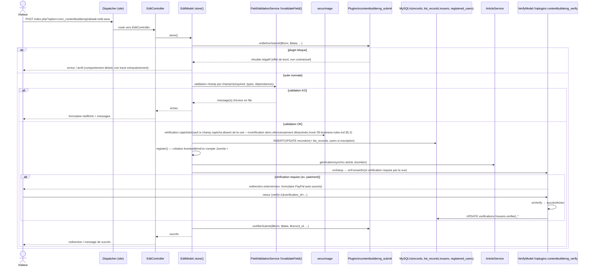
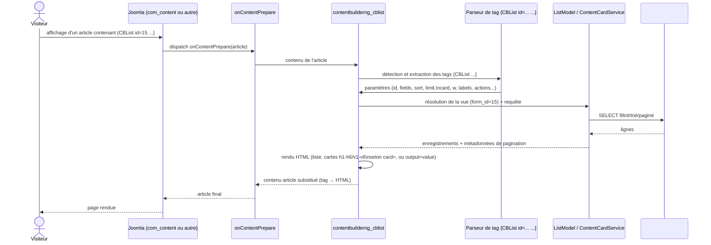
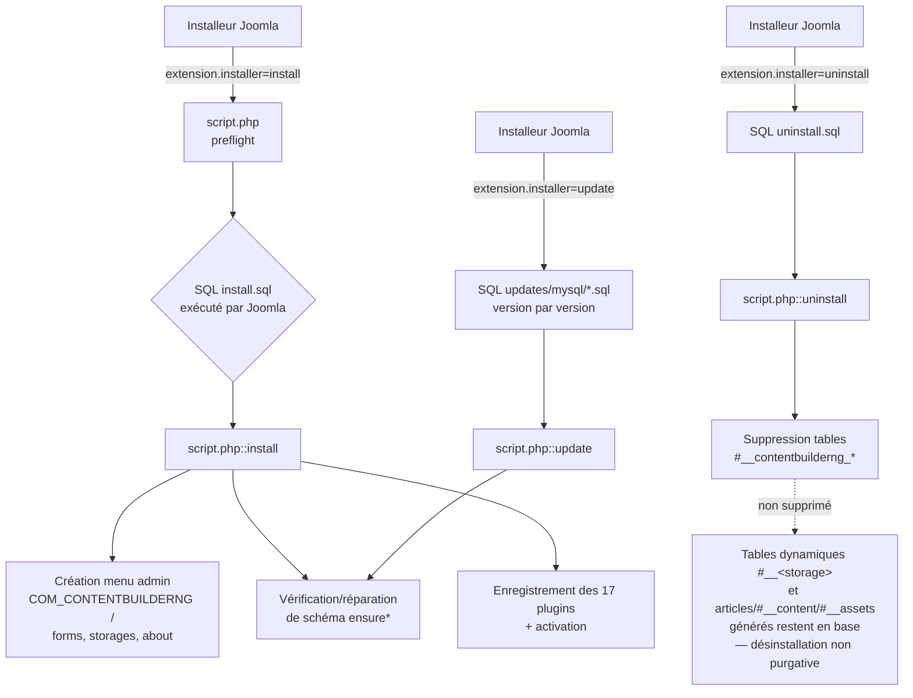
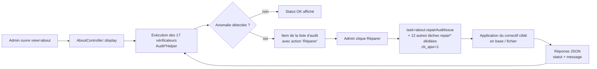
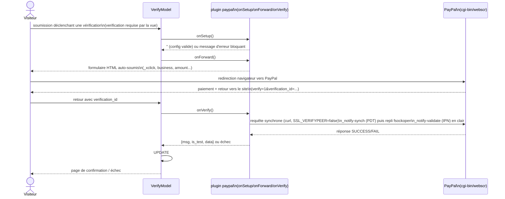
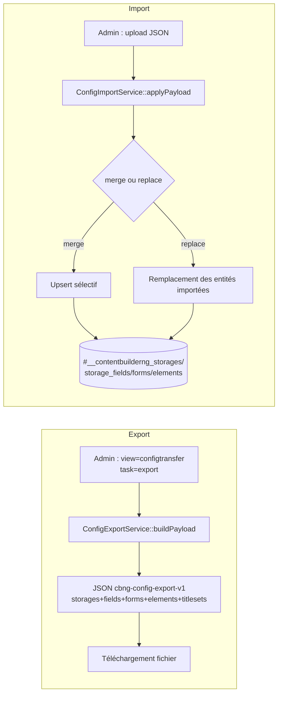

# 11 — Flux d'exécution (diagrammes)

> Légende : **Fait observé** / **Comportement déduit** / **Hypothèse** /
> **Zone inconnue** — voir `01-overview.md`. Sources : `06-api-contracts.md`
> (signatures d'événements), `03-data-model.md`, `09-business-rules.md`,
> `07-security.md`, `10-dependencies.md`, `02-architecture.md`.
>
> Ces diagrammes simplifient l'ordre réel des appels pour la lisibilité ;
> les numéros de ligne exacts de chaque étape sont dans les documents
> référencés ci-dessus, pas répétés ici.

## 1. Soumission d'un enregistrement front (création/édition), avec vérification

**Fait observé/Comportement déduit**, assemblé depuis `EditController`,
`EditModel::store()` (767-2294), et le contrat `onBeforeSubmit`/`onAfterSubmit`/
`onSetup`/`onForward`/`onVerify` (`06-api-contracts.md` §5.1-5.2).

**Zone inconnue** (`06-api-contracts.md` §7) : le point d'import exact de
`onAfterArticleCreation` (groupe `contentbuilderng_listaction`) dans cette
séquence n'a pas été localisé avec certitude — il s'articule très
probablement entre la génération d'article et la fin de `store()`, sans
confirmation ligne à ligne.

## 2. Rendu `{CBList}` dans un article Joomla tiers

**Fait observé/Comportement déduit**, assemblé depuis
`plugins/content/contentbuilderng_cblist/`, `docs/specifications/cblist.md`
(vérifié contre le code), `03-data-model.md`, `04-features.md`.

**Fait observé** (`06-api-contracts.md` §7) : `{CBStats}` suit un chemin
distinct mais parallèle — il existe aussi un point d'entrée HTTP direct
(`ApiController::display()` avec `action=cbstats`) qui partage le même
moteur de calcul et les mêmes fichiers `.ini` de titleset/groupset que le
plugin de contenu, mais reste un point d'entrée séparé (pas de dispatch via
`onContentPrepare` pour cet appel direct).

## 3. Installation / mise à jour / désinstallation

**Fait observé** (`script.php`, `com_contentbuilderng.xml`,
`12-technical-debt.md`).

**Fait observé** (`03-data-model.md` §"Zones d'incertitude") : la
désinstallation ne purge ni les tables dynamiques par storage, ni les
articles Joomla générés — conception assumée, pas un oubli documenté comme
tel dans le code lu.

## 4. Audit & Réparation (écran About)

**Fait observé** (`04-features.md`, `06-api-contracts.md` §4.5) : 17
vérificateurs d'intégrité, réparation guidée en 17 étapes, exposée via des
tâches AJAX `about.repair*` (indicateur `cb_ajax=1`, pas de `com_ajax`
Joomla).

## 5. Vérification par paiement PayPal

**Fait observé** (`10-dependencies.md` §3, `07-security.md` §10,
`06-api-contracts.md` §5.2) : protocole legacy Website Payments Standard.

**Fait observé** : `CURLOPT_SSL_VERIFYPEER=false` sur les deux appels
sortants — documenté comme observation de sécurité dans `07-security.md`,
non corrigé (hors périmètre de cette rétro-analyse).

## 6. Export / Import de configuration (Config Transfer)

**Fait observé** (`06-api-contracts.md` §6.1, `04-features.md`).

**Zone inconnue** (`06-api-contracts.md` §8) : l'atomicité de
`ConfigImportService::applyPayload()` (comportement en cas d'échec partiel)
n'a pas été tracée avec certitude.
